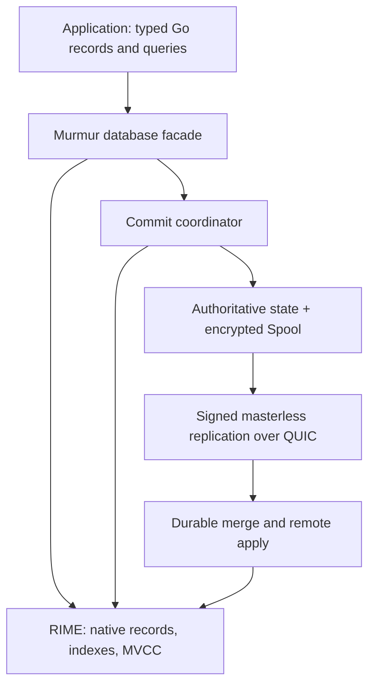

# Migration plan: RIME + Spool + masterless replication

Status: implementation and release qualification are in progress. Phase 6's
production cutover has removed the SQLite engine and SQL application transaction
path, deleted the `sqlengine/` package, removed the SQLite driver from the root
`go.mod`/`go.sum`, and removed SQLite build tags from production CI and live
runners. `CGO_ENABLED=0 go test -run '^$' -p 1 ./...` compiles the root module,
examples, tools, live scenarios, and RIME packages. There is no production SQL
API or SQLite runtime dependency. Historical SQLite comparison code remains
only in isolated nested benchmark modules and is excluded from production.

Managed `WriteTxContext` and explicit typed transactions share one durable-first
commit coordinator. Synchronous typed group commit now batches ordered Spool
commits while publishing RIME transactions in the same order. Focused tests
cover concurrent writers, contended rows, shared-fsync failure, process exit
before durability, close while a group is pending, and reopen reconstruction.

The overall migration is not complete. Remaining required work includes broad
storage-fault qualification, delivery-permutation and remote-interleaving
qualification, long-duration impaired-network/live soak runs, and reproducible
rich-record performance measurements. Exact before/after schema-manifest-store
crash recovery with two surviving peers and the sequential live release gate
have passed.
Current-version live fixtures use managed typed operations, with SQL requests
retained only in explicit endpoint-rejection tests; the release-upgrade fixture
uses SQL solely to seed the pinned previous-release binary. Historical SQLite
comparisons remain isolated in nested benchmark modules. Historical
implementation notes later in this file describe earlier migration steps;
current source and test evidence takes precedence when they differ.

## 1. Objective and decisions

Replace Murmur's SQLite materialization and SQL application surface with RIME's
native Go records, typed queries, indexes and MVCC transactions. Murmur becomes
an embedded Go database combining RIME execution, encrypted Spool persistence
and masterless replication over QUIC with mutual TLS. Every node remains
writable offline; replicas converge after communication resumes. Replication is
asynchronous and does not promise globally serializable transactions.

Decisions confirmed with the user:

- Remove SQL statements and the `database/sql` application interface. Applications
  migrate to the capabilities available through RIME; SQLite compatibility is
  not a requirement.
- Allow a durable-format and replication-protocol break. Do not implement
  automatic legacy database conversion or mixed-version replication in this
  migration.
- Support rich Go records, including nested structs, collections and explicitly
  registered custom types. Do not restrict the new database to SQLite scalars.

Implementation defaults chosen by this plan:

- Keep RIME independently usable and dependent only on the Go standard library.
  Murmur owns encoding, durable state, schema manifests and replication.
- Preserve synchronous acknowledgement after Spool fsync as the default, along
  with opt-in asynchronous durability and synchronous group commit.
- Preserve existing origin authentication, idempotency, tombstones, snapshots,
  retention, backup/restore, encryption/key rotation and peer management.
- Default conflict resolution is last-writer-wins per top-level record field.
  Nested structs, slices and maps are atomic field values, not automatically
  element-wise CRDTs. Explicit merge types provide counter/set semantics.
- Start with concurrent transaction preparation and an ordered commit
  coordinator. Parallel commit publication is a later measured optimization,
  not a prerequisite for removing SQLite.

## 2. Current implementation and reusable foundations

Before cutover, Murmur used a shared in-memory SQLite instance to execute SQL,
capture writes and materialize durable winners. That engine, capture path and
driver have been removed. The current [commit coordinator](db.go) prepares
managed typed writes, commits them to Spool, then publishes through RIME;
durable receive uses the same native materializer. [Schema manifests](schema/manifest.go)
retain stable identifiers, ancestry and schema identities.

[RIME](rime/ARCHITECTURE.md) provides native record storage, sharded lookups,
MVCC, hash/ordered/prefix/compound indexes, typed filters, scans, aggregates,
joins, staged query overlays, deep ownership for exported mutable fields,
explicit `Optional[T]` presence, and explicit write transactions. It now exposes
coalesced prepared changes and a managed publication token that holds commit
order through adapter durability. Managed publication now faults closed with
an uncertain outcome if locked installation panics, and callbacks after a fully
published commit remain distinguishable. A managed-install regression test
now covers hash, ordered, prefix, compound, unique and shard-map growth paths
and caps this mixed indexed/shard-growth publication path at two allocations
after preparation. The Phase 1 exit gate now passes: deterministic model
equivalence covers point/indexed/full reads, joins and aggregates, while the
full RIME package and its race-enabled suite pass rollback, contexts, hooks and
concurrent index checks. Remote interleavings remain part of the replication
milestones, not the standalone RIME transaction gate.
`Open` accepts only managed typed-table configurations and uses RIME as their
query materializer. Remaining SQL references in `tests-live/` are limited to
removed-endpoint rejection tests and the previous-release compatibility fixture;
they are not a supported current-runtime mode.

[Spool](spool/README.md), the authoritative state layer, CRDT/version comparison,
QUIC transport, origin signatures and replication scheduling remain foundations.
The state layer currently retains its own memory index; migration must measure
that memory in addition to RIME rather than claiming one in-memory copy.

## 3. Target ownership and public API

### 3.1. Murmur is the application entry point

Expose Murmur-owned typed table/query handles that delegate execution to RIME.
Do not expose a writable raw RIME database/table or return raw `rime.Query`
objects: those objects also support mutation and could bypass persistence.
Fields and expression values may reuse RIME types where they carry no mutation
capability. Wrap reads and writes that need database/transaction lifecycle checks.

Implement these proposed API families; exact signatures belong in compile-time
API fixtures before implementation:

- `Define[T](name, tableID, options...) (TableDefinition, error)` compiles record
  metadata; `Config.Tables []TableDefinition` supplies definitions before `Open`.
  Definitions carry explicit stable field IDs, primary key, merge policies,
  indexes, codec identities and field-presence/default metadata.
- `TableOf[T](db, name) (*Table[T], error)` retrieves a typed handle only if the
  registered type matches. Use generic functions rather than generic methods.
- Tables provide `Get`, `Insert`, `Save`, `Update`, `Delete`, batch variants and
  `Where`; query wrappers provide filtering, ordering, pagination, compiled
  parameters, `Find`, `First`, `Count`, aggregates and query mutations. Provide
  context-aware variants and typed join/projection helpers.
- `DB.WriteTxContext(ctx, func(*Tx) error)` is the preferred write API. Also
  provide `BeginTx(ctx)`, `Tx.Commit()` and `Tx.Rollback()` for existing host
  lifecycle needs. Every write passes through the same coordinator. Nil write
  transactions create implicit Murmur transactions, never raw RIME auto-commits.
- `DB.ReadTxContext`, `ReadAt`, snapshot IDs and read-handle closure pin RIME
  versions. Murmur checks closed/failed/maintenance states on every entry point.
- Retain `Open`, `Close`, `Sync`, status, diagnostics, peer configuration,
  encryption and backup APIs with Go-schema equivalents. Remove SQL statement
  caches, SQL preparation/results, SQL DDL configuration and the SQL driver.

Published pointers remain immutable. Readers may share them; applications needing
mutable output use an explicit clone helper. Query builders and write transactions
remain owned by one goroutine. A read snapshot is local, not a cluster-wide time.

### 3.2. Tables, keys and local data

Replicated primary keys are immutable 16-byte `RowID` values supplied by the
application or generated by Murmur's existing random ID generator. Do not use a
node-local sequence to generate replicated identity. Other RIME key types remain
available for standalone RIME and node-local tables. Do not infer durable table
or field IDs from declaration order or mutable names.

Tables are persistent and replicated by default. Explicit node-local tables are
persistent but excluded from replication; their fields currently use LWW and
their descriptors remain application-defined rather than in the cluster
manifest. Local-only mutations join the same local Spool transaction as
replicated mutations. An explicit ephemeral option creates nonpersistent local
data. Reject mixed durable/ephemeral writes in a single transaction in the
first release to avoid ambiguous recovery semantics.

## 4. Record schema, encoding and evolution

Implementation status for this milestone is tracked in
[the RIME migration schema document](architecture/rime-migration-schema.md).

### 4.1. Rich Go types and canonical encoding

Compile recursive descriptors at definition time and use them for cloning,
comparison, field-delta construction and encoding. Encoding occurs at the
persistence/network boundary, not on ordinary reads or predicate evaluation.

Built-in support includes booleans, fixed-width signed/unsigned integers,
float32/64, strings, byte slices, arrays, exported nested structs, slices, maps,
optional pointers and explicit `Optional[T]` values. Normalize `int`/`uint` as
64-bit wire values and reject decode overflow on the host architecture. Preserve
named scalar types. Encode `time.Time` as a UTC instant without its monotonic
component; applications needing original timezone metadata store it separately.

Use a versioned canonical binary format with kind tags, bounded length prefixes,
explicit presence and stable struct field IDs. Sort map entries by canonical
encoded key; initially allow scalar integer/bool/string and fixed byte-array map
keys. Reject pointer/float/struct map keys without a custom codec. Keep nil slices
and maps distinct from empty collections, and NULL distinct from scalar zero.
Preserve IEEE float bits, including signed zero; define equality and ordering
for NaN in RIME explicitly before allowing float indexes.

Custom types require an explicit deterministic codec ID/version, canonical
Encode/Decode and clone/equality functions. Every participating application must
register the same codec identity; unknown codecs cannot be queried as native
records. Do not use gob, arbitrary JSON fallback or process-specific Go type
names as wire identity. Support schema-described records without a plugin.

Reject cyclic object graphs, interface-typed fields without a registered closed
variant descriptor, functions, channels and unsafe pointers. Reject unsupported
fields at definition time and cycles in supplied records before commit. Initial
defensive limits: nesting depth 64 and one million collection elements per field,
further bounded by configured value, transaction, snapshot and decode budgets.
Validate lengths before allocation and prohibit custom-codec bypass of byte caps.

### 4.2. Nullability, defaults and ownership

Pointers/`Optional[T]` express presence; `0`, `false`, empty strings and empty
collections are legitimate values. NOT NULL tests presence rather than zero.
Defaults apply only when a value is absent, never merely zero. Nonoptional fields
are always present; their Go zero value is the initial value unless the schema
requires explicit construction. Do not persist executable default functions.

Deep-copy mutable input on insert/save and before update callbacks. Copy caller
byte buffers and recursively clone slices/maps/pointers. Codec-produced values
must satisfy the same ownership rules. Mutation after an API call must not change
committed data, durable bytes or an old snapshot.

### 4.3. Manifests and schema changes

Keep durable schema manifests and ancestry, extended with recursive descriptors,
codec IDs/versions, field IDs, presence rules and merge policies. Runtime Go
registration binds executable types to the manifest; remote metadata cannot load
Go code. Go field renames preserve IDs. RIME index configuration is node-local
and excluded from replicated logical schema identity.

The first release supports additive tables/fields and renames. Add fields with
explicit deterministic initial values or optional absence. Type, codec or merge
policy changes require a separately identified replacement field and application
backfill; dropping/reusing IDs is prohibited. Index rebuilds are maintenance
operations and must not make schema state ambiguous after failure.

Retain unknown compatible fields in authoritative state and preserve them through
writes by older applications. Typed materialization projects known fields; Save
replaces known fields without erasing unknown fields. Required unknown tables,
incompatible field types/codecs and incompatible schema branches use bounded
schema-hold/error handling rather than silently dropping data. Compatible
additions can merge by ancestry; incompatible revisions require operator action.

## 5. Transaction, persistence and publication protocol

### 5.1. RIME integration primitives

Add an explicit write lifecycle and an immutable prepared-change representation
containing stable table/key identity, operation, old/new record values, base
versions and final per-key state. Repeated writes coalesce to one final delta,
while operation hooks retain their documented execution counts. Transactions
expose capture before publication; no replication is driven by async event queues.

Separate validation/preparation from publication. A managed prepare token owns
all preallocated record/index changes and the synchronization needed to prevent
base invalidation. Abort releases it without advancing visibility. Publication
installs a complete validated batch and advances visibility once; callbacks run
after locks are released. Standalone RIME transactions use the same primitives
without requiring persistence. Integration contracts use standard-library types;
RIME does not import Murmur/state/Spool.

Overlay pending inserts, updates and deletes in every query path. Until staged
index planning is implemented, force a snapshot scan with a per-key overlay for
write transactions touching a queried table. Apply filtering/order/pagination to
the merged view, not before overlay. Joins and aggregates use that same view;
ignore invalidated committed candidates and include newly matching staged rows.

### 5.2. Ordered durable-first commits

Use one database commit coordinator shared by local commits, remote durable merges,
schema publication and rebuild switching. User callbacks prepare concurrently
outside it; the coordinator establishes the accepted commit order. Readers do
not hold a global lock across disk I/O. Remove the existing transaction-lifetime
`writeMu` once this protocol passes correctness gates.

For a local synchronous transaction:

1. Stage private writes at a pinned snapshot, run operation hooks and encode a
   candidate final-field delta. Reject record/value/transaction limits early.
2. Enter the coordinator, validate optimistic bases, key/claim constraints and
   BeforeCommit hooks. A conflicting base returns `ErrConflict` with no durable
   effect. Never automatically replay application callbacks.
3. Build the authoritative state merge and resulting native records. Assign
   origin identity, transaction ID, HLC and sequence in accepted order. Prepare
   both state and RIME publication data before disk commit; this includes indexes,
   local-only persistent values and all resulting CRDT values.
4. Commit mutation log, merged state, schema references and idempotency receipt
   atomically through Spool, waiting for fsync in synchronous mode.
5. Publish the prevalidated authoritative winners to RIME atomically, advance its
   visible generation, and release coordination. Publish hooks/subscription
   notifications and replication scheduling only for accepted committed work.
6. Acknowledge success after persistence and local publication. Success does not
   wait for peers and does not promise the value will defeat every concurrent
   remote write.

No fallible encoding, user hook or constraint check may occur between durable
success and required publication. Build allocation-dependent publication objects
before durability. An unexpected publication failure after durable success is a
terminal materializer fault: reject reads/writes, recover from Spool, and report
an uncertain commit outcome with its transaction ID. Do not pretend rollback
removed durable data. Receipts permit safe resolution/retry without duplicate
counter/set operations. Errors after an ambiguous disk write follow the same
uncertain-outcome contract; pre-durable rejection remains an ordinary rollback.
Cancellation before durable submission aborts; cancellation after submission
cannot promise rollback. The receipt/status path determines the outcome.

### 5.3. Group commit, asynchronous mode and contention

The coordinator may collect bounded local groups using existing defaults
(1 ms, 64 transactions, 4 MiB). Validate members against the ordered staged state:
conflicting stale bases are rejected individually; unrelated accepted members
share one Spool commit/fsync. Publish the accepted group at one visibility
frontier; callbacks retain individual transaction IDs. Do not let a failed disk
group publish any member. Bound queue depth/bytes and preserve scheduler admission.

Async mode acknowledges only after Spool append/state commit and RIME publication,
without waiting for fsync. Preserve `Sync`, interval/byte thresholds and explicit
crash-loss semantics. Synchronous mode never acknowledges before fsync.

Keep global publication coordination initially. Short locks and concurrent
preparation improve overlap, but do not promise fourfold throughput. Parallel
resource reservations/tickets must later extend this same durable ordering
protocol; do not implement an independent fast path that bypasses it.

## 6. Masterless merge and remote application

Reuse signed origin batches, hybrid clocks, stable IDs, receipts, anti-entropy,
peer watermarks, snapshot transfer and tombstone retention. Bump protocol and
codec versions, and negotiate capabilities before processing rich-record payloads.
Reject legacy/incompatible peers before applying data. Preserve signatures over
canonical bytes and enforce limits before decompression/decoding allocations.

LWW remains per top-level field with the existing deterministic version ordering.
Separate-field concurrent writes can combine into a record neither writer saw.
Nested collection fields are replaced atomically under LWW. Counters and sets
require explicit typed operations preserving causal IDs; raw replacement of
CRDT-owned fields is rejected. Numeric extrema retain their numeric policy.
Do not claim generic maps or slices merge element-wise.

Remote receive enters the same coordinator, merges authoritative state, prepares
complete winning native rows and commits Spool before publishing RIME. Grouped
receives commit their independent receipts and sequence positions together;
RIME publication completes synchronously before the apply acknowledgement.
Expose applied and durable generations separately where the API needs to report
an uncertain outcome. No delayed materialization settings or worker are part of
the typed API.

Internal apply bypasses local write capture and application before hooks. Emit
post-publication notifications with local/remote/rebuild origin metadata; never
create a new local replication batch from remote apply. Apply all rows of a
visible remote batch atomically. Tombstones, partial winners and resurrection
resolve from complete authoritative state, never from a partial payload alone.

Replicated tables cannot enforce secondary unique indexes, foreign keys or
arbitrary cross-field CHECK callbacks as globally guaranteed constraints.
Reject their registration for replicated tables in this first release; permit
nonunique indexes and enforce per-field schema/type/presence rules consistently.
Permit richer constraints on node-local tables. Ordinary application validation
may reject local attempts but cannot be used to reject otherwise valid remote
winners and prevent convergence. RIME standalone retains its own constraint API.

## 7. Recovery, subscriptions and retained features

Open validates storage format, application schema/codecs and cluster identity,
then rebuilds RIME from authoritative visible records before serving queries.
Bulk load into a private RIME generation, build indexes and atomically install it.
Do not expose partially rebuilt tables. Missing required codecs fail Open with an
actionable error. Bound rebuild buffers, support cancellation and report progress.

Retain state/wire metadata needed for receipts, tombstones, CRDT histories,
retention and snapshots outside the native record projection. Spool remains a
sequential persistence backend; do not introduce a requirement for disk point
reads. Measure the combined state/RIME/codec memory footprint. Defer eliminating
state's separate memory index until correctness and profiles justify it.

Typed query subscriptions now pin a RIME read snapshot with its observer cursor,
emit deterministic primary-key additions/updates/removals using canonical field
equality, support retained-window resume from a cursor, and reset on bounded
buffer overflow. Cursor generations across materializer rebuilds and
open epochs are now included in resume tokens, and materializer rebuilds
invalidate old tokens and reset active subscriptions. Cursors are explicitly
process-local: they do not survive reopen or represent fsynced consumer
positions, even in synchronous durability mode. Durable application
checkpoints remain outside this subscription API. Events are not the durable
replication log.

Rewrite bridge import/export around descriptors and typed changes, preserving
receipts, stream progress, policy ownership and CRDT causal identity. Port file
metadata tables, backup/restore, key rotation, maintenance and diagnostics without
SQL dependencies. Backup stores authoritative state plus schema/codec identities;
restore requires a compatible application and retains identity-adoption rules.
Views become reusable Go query functions. SQL triggers are removed; use explicit
transactional Go operations. FTS5 is removed without replacement in this migration;
RIME prefix/substring queries remain available and are not described as equivalent
full-text search. A full-text engine is a separate future feature.

## 8. Implementation milestones

Deliver each milestone as a reviewable change. Keep current production behavior
working until the replacement passes its gates; temporary internal test adapters
may coexist, but there is no released dual-engine product or SQL fallback.

| Phase | Deliverable | Exit gate |
| --- | --- | --- |
| 0. Contract and baseline | Compile-time typed API fixtures; rich-type/merge descriptor specification; format/protocol version allocation; inventory every SQL dependency | API examples cover reads, writes, schemas, local tables, CRDT operations and subscriptions; frozen performance and qualification cells recorded |
| 1. RIME transaction correctness | Explicit lifecycle, prepared changes, managed publication tokens, staged query overlay, explicit presence/defaults and deep ownership | Exact model equivalence across point/indexed/full reads, joins and aggregates; rollback, contexts, hooks and race checks pass |
| 2. Rich schema and codec | Recursive descriptors, stable IDs, canonical encoding, optional/custom values and new manifests | Deterministic encoding, bounded hostile decode, round-trip/clone fuzzing and compatible/incompatible schema tests pass |
| 3. Durable local database | Murmur table/query facade, coordinator, durable-first state preparation/publication, group/async modes and private rebuild | Crash-boundary tests prove acknowledged sync data survives; receipt/uncertain-outcome behavior, restart and no-bypass tests pass |
| 4. Replication and evolution | Rich batches, remote merge/apply, capability negotiation, schema holds and typed CRDT operations | Live partition/rejoin, delivery permutation, snapshots, schema branches and echo suppression converge |
| 5. Operational feature port | Typed subscriptions, bridges, files, backup/restore, rotation, maintenance and diagnostics | Live feature rehearsals pass against RIME; no durable user data remains in temporary SQL objects |
| 6. SQLite removal | Remove SQL APIs/engine/driver, dependency/build tags, SQL tooling and obsolete examples/tests; rewrite active documentation | Default build succeeds with CGO disabled; no production SQLite dependency or SQL application API remains |
| 7. Performance and release | Profile scans/mutations/rebuild/replication, apply independent optimizations and publish resource limits | Fixed-host performance cells and full live qualification pass; release notes describe breaking API/format changes |

Phase 0 version allocation is recorded in
[`internal/migrationcontract/versions.go`](internal/migrationcontract/versions.go):
store format 6, replication protocol 6, mutation codec 4, schema manifest
encoding 3, snapshot manifest 3, and record-value encoding 1. Runtime constants
now use format 6, replication protocol 6, mutation codec 4 and snapshot
manifest format 3. Format-5 SQL-era stores fail closed and require a fresh
directory.

### Current milestone status (2026-10-08)

| Phase | Status | Evidence / remaining work |
| --- | --- | --- |
| 0. Contract and baseline | Implemented | Version allocation is recorded in `internal/migrationcontract/versions.go`; baseline and qualification work is documented in `architecture/rime-benchmarks.md` and `architecture/rime-performance-plan.md`. |
| 1. RIME transaction correctness | Implemented; focused test follow-up pending | Deterministic model equivalence, transaction lifecycle, managed publication, staged overlays, ownership, contexts, and race checks are covered by the RIME suite. The current one-thread all-module run exposed a scheduler-dependent OCC conflict assertion; its test now uses a first-wave barrier, but the RIME suite was not rerun. |
| 2. Rich schema and codec | Implemented; continued adversarial qualification | Recursive descriptors, stable IDs, canonical values, presence, unknown-field preservation, and custom codecs are implemented. Continue hostile-input fuzzing and schema compatibility qualification. |
| 3. Durable local database | Implemented; release fault matrix remains | Managed typed writes use durable-first Spool commits, rebuild, uncertain receipts, and synchronous group commit. The root suite passes with CGO disabled. Continue broad process-kill and storage-fault qualification. |
| 4. Replication and evolution | Implemented; release interleaving gates remain | Typed replication, schema evolution, CRDT operations, snapshots, and bridge import have live coverage. Randomized three-origin delivery with duplicates, exact before/after manifest-store crashes on an isolated peer with two surviving peers, and concurrent local/remote same-record plus disjoint-key commits followed by reopen pass. Broader transport/interleaving stress remains required. |
| 5. Operational feature port | Implemented; soak acceptance remains | Typed subscriptions, bridges, files, backup/restore, rotation, maintenance, and diagnostics use the managed API. The full release live gate passed sequentially; impaired-network and scheduled soak acceptance remain. |
| 6. SQLite removal | Production cutover implemented; complete all-package suite pending | Production SQL API, SQLite engine/package/driver, SQL CLI commands, and SQLite build-tag dependency are removed. The root Murmur suite passes with CGO disabled; current-version live fixtures use managed typed operations; the previous-release fixture retains SQL helpers only to seed the historical binary, and API-removal tests assert current endpoints reject SQL requests. Isolated benchmark modules retain historical SQLite comparisons. |
| 7. Performance and release | In progress | Breaking API/format notes are drafted in `RELEASE_NOTES.md` and the full live gate passed. Five independent Murmur 100K local-store and transaction-batch characterization runs are recorded in `architecture/benchmarks.md`; the broader fixed-host concurrency/write-mix and live-network performance matrix, scheduled soak qualification, and remaining storage/interleaving gates must pass before claiming migration completion. |

Recent verification on the current worktree:

- `CGO_ENABLED=0 go test -p 1 . -count=1` — passed.
- Five sequential process-isolated runs of `CGO_ENABLED=0 GOMAXPROCS=1 MURMUR_PERF_TIER=standard MURMUR_PERF_ONLY=store go test -run '^TestPerfMatrix$' -count=1 -timeout=5m .` from `tests-benchmark/benchmark` — passed; each run measured the 100K Murmur local-store cells without starting testnodes. Medians and observed ranges are in [the characterization matrix](architecture/benchmarks.md#current-typed-store-characterization-2026-10-08).
- Five sequential process-isolated runs of `CGO_ENABLED=0 GOMAXPROCS=1 MURMUR_PERF_TIER=standard MURMUR_PERF_ONLY=tx go test -run '^TestPerfMatrix$' -count=1 -timeout=5m .` from `tests-benchmark/benchmark` — passed; each run measured 100K-record Murmur insert batches of 1, 10, 100 and 1,000 without starting testnodes. Medians and observed ranges are in [the characterization matrix](architecture/benchmarks.md#current-typed-store-characterization-2026-10-08).
- `CGO_ENABLED=0 go test -p 1 . -run '^TestGroupCommit' -count=1 -timeout=2m` — passed.
- `CGO_ENABLED=0 GOMAXPROCS=1 go test -p 1 ./spool -count=1 -timeout=3m` — passed after bounding the key-rotation/prune stress fixture; its focused rerun exercised 745 seals, 262 rotations and 282 prunes in 3.1 seconds, then reopened and verified the store.
- `CGO_ENABLED=0 GOMAXPROCS=1 go test -run '^$' -p 1 ./... -count=1` — passed (all root-module packages, examples and live tests compile; tests were not executed).
- `CGO_ENABLED=0 GOMAXPROCS=1 go vet -p 1 ./...` — passed.
- `CGO_ENABLED=0 GOMAXPROCS=1 go test -p 1 . -count=1` — passed in 126.0s (Murmur root package only; no RIME or Spool package tests run).
- `CGO_ENABLED=0 GOMAXPROCS=2 go test -p 1 ./metrics -count=1` — passed.
- `CGO_ENABLED=0 GOMAXPROCS=2 bash tests-live/run.sh typed-records` — passed.
- `CGO_ENABLED=0 GOMAXPROCS=2 bash tests-live/run.sh typed-bridge` — passed.
- `CGO_ENABLED=0 GOMAXPROCS=1 MURMUR_LIVE_RUNTIME=/tmp/murmur-migration-crash-exact-2 bash tests-live/run.sh migration-crash` — passed with three live Murmur peers at both exact schema-manifest boundaries. A test-hook process exit before store reopened at epoch 1 and retried; exit after store reopened at epoch 2. Both cases recovered records and converged with two surviving peers, including a migrated-field update.
- `CGO_ENABLED=0 GOMAXPROCS=1 go test -p 1 . -run '^TestTypedLocalAndRemoteCommitsInterleaveAndRecover$' -count=1 -timeout=2m` — passed; 64 local transactions and 65 remote batches raced on one Murmur database, preserving 129 records and the version-defined same-row winner across reopen; remote batches did not echo to the local log.
- `CGO_ENABLED=0 GOMAXPROCS=1 go test -p 1 ./state -run '^TestConvergenceProperty$' -count=1 -timeout=2m` — passed; three origins delivered 180 mutation batches in differing orders with 10% duplicate replays to separate Murmur stores, which converged to identical final state.
- CGO-disabled live runs for `api-mtls`, `backup-restore`, `backup-under-fire`, `bridge-two-streams`, `files-bridge`, `files-corrupt-source`, `files-crash`, `merge-policies`, `migration-concurrency`, `migration-crash`, `origin-signatures`, `partition`, `rekey`, `schema-evolution`, `snapshot-resync`, `tampered-backup`, `three-node-sync`, `typed-bridge`, and `views` — passed sequentially. These runs used at most four nodes at once.
- `long-running-five-node` — passed a bounded 9-second typed-write smoke with five nodes, two orderly restarts, and convergence verified by sorted record digest; the one-hour acceptance duration remains pending.
- `rejoin-storm` — passed with 12 outage writes, simultaneous restart of two nodes, convergence and post-rejoin writes; `crash-loop` — passed two SIGKILL/restart rounds with 152 acknowledged writes recovered. Both used typed RIME records and CGO-disabled binaries.
- `hostile-peer` and `hostile-schema` — passed live against managed typed records, including malformed/replayed replication frames, schema quarantine, and post-attack convergence.
- `chaos-load` — passed a bounded partition/heal smoke with three typed-record writers; nodes held divergent state while isolated and converged after healing.
- `corrupt-snapshot` — passed its full 98-second retention-expiry run; the typed-record receiver rejected a tampered snapshot without publication and converged from an honest source.
- `txchunk-resume` — passed a bounded 8.6 MiB typed `InsertMany` transaction with a mid-transfer receiver SIGKILL, restart, atomic visibility, and replay completion; CGO was disabled and the cluster used three nodes.
- `scale-mesh` — passed live with ten daemons, 400 managed typed rows from two origins, converged digests, and no selected-peer fanout above four; runtime cleanup completed (7.3s test).
- `CGO_ENABLED=1 GOMAXPROCS=1 bash tests-live/run.sh gate` — passed every release-gate scenario sequentially (936s); typed scenarios used the runner's CGO-disabled builds, and previous-release compatibility used its pinned SQLite-era build. The gate included ten-node scale mesh, storage/process-kill recovery, format rejection, hostile inputs, live bridges/files/backups, partition healing, certificate lifecycle, and the unlock anti-oracle check.

The all-package `go test ./...` acceptance remains incomplete. A constrained
one-thread run passed the root, Spool, and many package suites, but exposed a
scheduler-dependent OCC conflict assertion in RIME and later entered the
ten-node, ten-minute `tests-live/abuse` default. The run was stopped before
completion to keep test scope and process use bounded; the root Murmur suite was
then rerun and passed. The OCC test now synchronizes its first transaction wave,
but that RIME suite was not rerun. Per the current test-scope instruction,
qualification runs are limited to Murmur tests and live Murmur scenarios;
RIME and Spool package suites are not run. The complete release gate and
ten-node scale acceptance have passed; fixed-host performance, scheduled soaks,
and remaining storage/interleaving qualification remain pending. Legacy SQL calls
remain only in previous-release compatibility fixtures and explicit tests that
verify the removed SQL endpoints reject requests. The migration remains incomplete
until remaining Phase 3–5 fault/interleaving, typed live soak, Phase 6 full-suite,
and Phase 7 performance/release gates pass. Historical SQLite comparisons are retained
only under `tests-benchmark/` nested modules and are not part of the production
module or API.

## 9. Verification and performance acceptance

No tests or benchmarks are run merely to write this plan. The commands and gates
below are required during implementation, when validation execution is requested.

- **API/ownership:** prove every public mutation, including query Update/Delete,
  batch operations and nil-transaction calls, persists and participates in
  replication. No exported mutable engine handle bypasses coordination.
- **Transactions:** model staged insert/update/delete/reinsert, repeated keys,
  indexed predicate membership changes, joins, aggregates, pagination, callbacks,
  cancellation, explicit rollback and local/remote commit interleavings.
- **Types/encoding:** null versus zero/empty, integer limits, float edge cases,
  nested records, maps in different insertion orders, custom codecs, cycles,
  aliasing, nil collections, unknown fields and malicious lengths/depth.
- **Crash/recovery:** inject failure before durable submission, during append,
  before/after fsync, after durable commit/before publication, during group commit,
  rebuild, schema publication, backup and restore. Reopen real encrypted Spool
  directories in separate processes. Include sync and async loss contracts.
- **Replication:** duplicate/reordered batches, offline concurrent writes to the
  same/different fields, nested-field replacement, counters/sets, tombstone versus
  resurrection, three-node partitions/rejoin, snapshot catch-up, schema holds,
  origin authentication, corrupt payloads and old-peer rejection.
- **Constraints:** prove replicated definitions reject unsupported uniqueness/FK/
  CHECK guarantees, and valid remote field combinations remain materializable.
- **Operations:** live four-reader/four-writer workloads with GC/pinned snapshots,
  bridge retries, file transfers, rotations, disk-full handling, subscriptions,
  peer retirement, retention, shutdown and cancellation. Preserve relevant
  [existing live rehearsals](tests-live/README.md).

Run relevant package/model tests per milestone, `go test -race ./...`, `go vet
./...`, and the applicable live suites. At SQLite removal, `CGO_ENABLED=0 go test
./...` must build and pass the normal suite; optional SQLite comparison fixtures
must move to a separately enabled benchmark module and cannot remain in default
module imports. Keep fuzz targets for codecs, mutation models and schema merges.

Freeze unprofiled cells with one/four writers, transaction sizes 1/16/256,
100K/1M records, representative scalar and rich payloads, matched indexes,
disjoint/hot keys, raw scans, filtered scans, aggregates, joins, restart rebuild
and remote catch-up. Keep in-memory-only RIME, async persistence and synchronous
persistence results separate. SQLite measurements are historical references,
not required application semantics. Use medians of at least five fixed-host runs
and capture profiles separately, following [benchmark methodology](architecture/rime-benchmarks.md).

Report successful records/s, retries, read/commit p50/p95/p99, bytes/allocations
per operation, total retained heap, disk bytes and replication bandwidth. Use a
provisional 10% regression investigation threshold on comparable point reads,
commit p99 and retained memory. Synchronous throughput is bounded by disk/fsync;
never compare durable Murmur commits with memory-only SQLite and call the
result an engine speedup. Require concurrent-writer and pinned-history cells
before accepting parallelism changes. Publish measured rich-record overhead.

## 10. Cutover, documentation and completion criteria

Introduce explicit new storage/snapshot/manifest markers and a new negotiated
replication protocol version. Allocate concrete numbers from the live source
constants in phase 0 to avoid collisions with concurrent format changes. Opening
legacy directories must fail without writing to them; require a fresh directory
for this release. A backup is not an automatic old-to-new converter. Keep the old
release available for reading/exporting legacy data; a conversion tool can be a
separately scoped follow-up.

Remove the SQLite import from production `go.mod`/`go.sum`, SQL capture hooks,
SQL statement cache, driver registration and mandatory SQLite/CGO build tags.
Update CI, tools, benchmarks and examples to typed Go operations. Remove obsolete
SQL/FTS tests only after replacing applicable durability/replication assertions.
Retain package/module identity unless a separately approved release decision
changes it; describe the major API break explicitly in release notes.

Update topic documents for transactions, schemas, storage, queries, replication,
conflict resolution, subscriptions, security and operational recovery as their
implementations land. Rewrite the root README around the new Go API only at
cutover; before then keep a clearly marked target-design link. Maintain
[RIME architecture](rime/ARCHITECTURE.md), the
[architecture index](architecture/README.md) and the vendor inventory. No new
external dependency is required by this plan. If one is introduced later, document
its version, maintainer, origin, license and purpose in [VENDORS.md](VENDORS.md).

Migration is complete when applications use Murmur's managed RIME API, all durable
writes go through Spool, masterless peers converge under live faults, restart
reconstructs native records, operational features work without SQL, and the
production build has no SQLite or CGO requirement. Release evidence must include
correctness/live results and reproducible performance measurements; implementation
status changes only after those gates pass.
