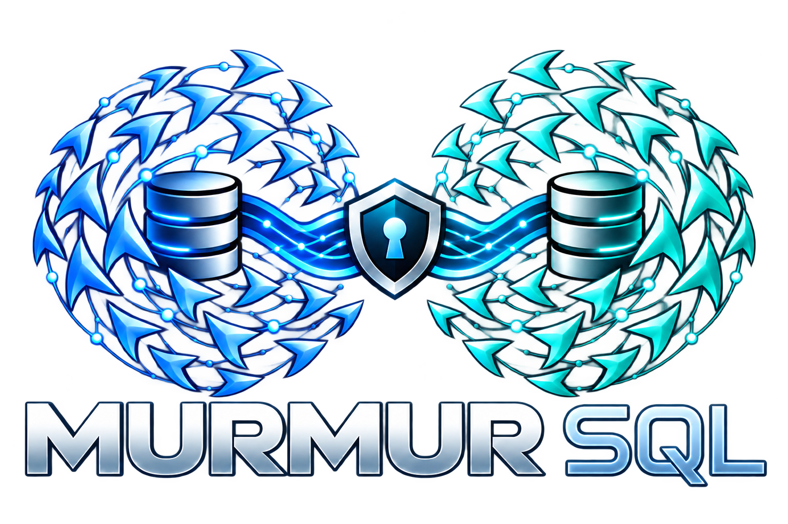

# MURMUR-SQL

<p align="center">
  
</p>

A murmuration is a flock of starlings wheeling across the sky as
one: no bird leads, each one simply watches its neighbors and adjusts,
and from those small local reactions emerges a single shape that holds
together even as birds drift apart and rejoin. Murmur-SQL is built on
that pattern. Every node is a fully writable database that keeps
working offline, exchanges only change deltas with the peers it can
currently reach, and converges with the rest of the flock without a
leader — so a cluster that is sometimes partitioned, sometimes
disconnected, still acts in unison and heals into one consistent
shape whenever its nodes talk again.

Murmur is a security-focused embedded Go database. RIME provides the in-memory
typed query engine, Spool provides encrypted persistence, and replication is
masterless. Applications define managed record tables with `Config.Tables`.

- **Typed records and queries** through RIME
- **Durable state** in Spool (authoritative; RIME materialization rebuilds from it)
- **Masterless multi-writer replication** over QUIC with mutual TLS
- **Offline writes** on every node, per-column last-writer-wins via hybrid
  logical clock (per-field last-writer-wins cell model)
- **Encrypted storage** with multiple cipher options, storage-key rotation, snapshots for new or stale nodes, replication-log garbage collection
- **Cross-domain unidirectional airgap**: allow data to transfer from a low domain flock to a high domain flock

Typed RIME peers reconcile remote tombstones idempotently, including when a
delete arrives before the corresponding row. The SQLite engine, SQL application API, driver dependency, and CGO build tags
have been removed from the production module. RIME is the only managed query
materializer and Spool is authoritative. Migration qualification remains in
progress; see [the migration plan](MIGRATION_PLAN.md#8-implementation-milestones)
for the remaining fault, replication, and release gates. The breaking API and
format changes are listed in [release notes](RELEASE_NOTES.md).

The architecture and implementation documentation is in [architecture/](architecture/README.md) folder, split into smaller topic documents.  Start with the [architecture overview](architecture/overview.md).

The [Spool package](spool/README.md) implements the sole persistence backend
engine for fast concurrent buffered writes (append/update/delete, flush,
full startup load, background compaction; no disk `Get`) with AES-256-GCM encryption.

## Reused packages

The implementation leans on existing Go packages instead of reinventing them. For a complete software bill of materials with vendor organizations, publisher details, countries of origin, and licenses, see [VENDORS.md](VENDORS.md).

| Concern | Package |
|---|---|
| In-memory immutable radix tree state store & snapshots | `github.com/hashicorp/go-immutable-radix` |
| At-rest AEADs (AES-GCM; ChaCha20-Poly1305, XChaCha20) | Go stdlib `crypto/aes`, `golang.org/x/crypto` |
| QUIC transport with TLS 1.3 | `github.com/quic-go/quic-go` |
| SWIM membership discovery & transport | `github.com/hashicorp/memberlist` |
| Node/row/tx/cluster IDs | `github.com/google/uuid` |
| Snapshot/wire compression | Standard library `compress/flate` (deflate) + pluggable `compression.Codec` |
| mTLS PKI, structured logging | stdlib (`crypto/x509`, `log/slog`) |

Production source and module metadata contain no SQLite driver or SQL engine.
The optional historical performance comparisons live in isolated benchmark
modules and are excluded from production builds.

Key delivery is the hosting process's responsibility: the process obtains the
encryption key (local config, KMS, or its own HTTP listener) and passes key
material to `Open` directly or through a `KeyProvider`. Murmur provides no
HTTP unlock endpoint. See
[runtime and diagnostics](architecture/runtime-and-diagnostics.md#optional-service-adapter).

Replication uses Ed25519 origin signatures and protocol 6. Fresh Spool stores
use format 6; format-5 SQL-era stores fail closed and must be exported by the
previous release before opening a fresh directory. Remote snapshots require
separately trusted source nodes. See [origin signatures](architecture/origin-signatures.md)
for provisioning, restore and security boundaries.

The [`rime/`](architecture/rime.md) package is a zero-dependency in-memory MVCC
relational engine with a native Go API (no SQL parsing). Murmur uses it as its
managed query materializer. It supports
[maintained Go query views](rime/USAGE.md#maintained-query-views) with cached
results, incremental filters, and synchronous complex-query reevaluation. Its
[qualification suite](architecture/rime-testing.md) includes reference-model
fuzzing and a [standalone concurrent live workload](tests-live/rime/README.md).
Its [SQLite comparisons](architecture/rime-benchmarks.md) cover one and four
writers against shared in-memory databases with matching secondary indexes.
The [performance plan](architecture/rime-performance-plan.md) records proposed
work based on write profiles; concurrent commit publication is not yet implemented.
See [RIME's usage reference](rime/USAGE.md) for its current Go syntax and
[architecture](rime/ARCHITECTURE.md) for storage, snapshots, indexes and
reader/writer coordination.

The [migration plan](MIGRATION_PLAN.md) records the remaining release
qualification for the managed RIME API. Applications define tables with
`Define[T]`, provide them through `Config.Tables`, and access them with
`TableOf[T]`. `WriteTxContext` and explicit `BeginTx` transactions persist
changes to encrypted Spool before publishing them to RIME. The typed API
supports managed CRUD, LWW fields, MIN/MAX, PN_COUNTER, OR_SET, pinned reads,
filters, order/page/count, compiled parameters, aggregates, joins, subscriptions,
node-local durable tables, and ephemeral tables. Remote winners rebuild into
RIME without echo. For ambiguous durable failures,
`CommitOutcomeUncertainError` exposes the transaction ID and
`HasTransactionReceipt` resolves it after reopen. The remaining migration gates
are listed in [MIGRATION_PLAN.md](MIGRATION_PLAN.md).
`DB.GC(ctx)` runs a context-bounded replication log and receipt collection pass
using persisted peer acknowledgements and retention limits.
Remote materialization streams affected rows from one authoritative snapshot
into one RIME transaction, up to a bounded 100,000 rows per apply.
Compatible additive schemas preserve unknown nested struct, array, slice and
map-value fields when older typed writers update known values.
Additive typed schema changes can be published at runtime with
`DB.MigrateRecords(ctx, completeDefinitions)`; compatible older typed peers
retain unknown fields while adopting the new manifest. The `typed-records`
live test checks an older peer's write and restart after migration, and verifies
offline PN_COUNTER and OR_SET updates converge after reconnect. It also checks
two concurrent additive schema branches merge after reconnect with both field
values retained. Operational feature ports are implemented. The live `rekey`
scenario rotates a typed database and verifies records after restart; the live
`backup-restore` scenario verifies typed recovery under a fresh writer identity.
Bridge schema validation uses the persisted manifest, typed row-existence
checks use RIME, and native imports commit imported data with provenance and
source receipts through Spool before RIME publication. The live
`typed-bridge` scenario verifies Low-to-High import and restart reconstruction.
Bridge row imports now require managed typed tables; the legacy SQL import
transaction has been removed.
See the
[migration status](MIGRATION_PLAN.md).

## Quick start

The application loads a persisted Ed25519 private key and provisions public
bindings independently of TLS. `origin` below is
`github.com/marcgauthier/murmur/origin`; `ed25519` is `crypto/ed25519`.

```go
nodeID := murmur.MustNodeID("00000000-0000-4000-8000-000000000001")
originKeys, err := origin.NewKeyRegistry(map[murmur.NodeID]ed25519.PublicKey{
    nodeID: signingPrivateKey.Public().(ed25519.PublicKey),
    peerID: peerSigningPublicKey,
})
if err != nil { return err }
db, err := murmur.Open(ctx, murmur.Config{
    Path:   "./node-data",
    NodeID: nodeID,
    OriginSigning: murmur.OriginSigningConfig{PrivateKey: signingPrivateKey, TrustedKeys: originKeys},
    Schema: murmur.SchemaConfig{
        Version: 1,
        Tables: []schema.TableSchema{{
            Name: "contacts",
            Columns: []schema.ColumnSchema{
                {Name: "id", Type: schema.ColBlob},
                {Name: "name", Type: schema.ColText, Nullable: true},
                {Name: "phone", Type: schema.ColText, Nullable: true},
            },
        }},
    },
    Spool: murmur.DefaultSpoolConfig(),
    Encryption: murmur.EncryptionConfig{
        Key:             key32, // or Provider for KMS/file/env sourcing
        KeyID:           "app-key-1",
        DataKeyRotation: 24 * time.Hour,
    },
    Replication: murmur.ReplicationConfig{
        ListenAddr: "127.0.0.1:7443",
        TLS:        &murmur.TLSCredential{CertPEM: cert, KeyPEM: key, CAPEM: ca},
        Peers:      []murmur.Peer{{NodeID: peerID, Addrs: []string{"127.0.0.1:7444"}}},
        TrustedSnapshotSources: []murmur.NodeID{peerID}, // explicitly trusted for merged recovery
    },
})
if err != nil {
    return err
}
defer db.Close()

id := murmur.NewRowID()
_, err = db.ExecContext(ctx,
    `INSERT INTO contacts (id, name, phone) VALUES (?, ?, ?)`,
    id[:], "ann", "613-555-0100")
```

For local applications that accept a short loss window after a crash, set
`Durability: murmur.DurabilityConfig{Mode: murmur.DurabilityAsync,
SyncInterval: time.Second}` in `Config`. Individual commits return without a
disk sync; the database syncs Spool about once per second and also syncs on
graceful close. The default remains a disk sync before each write acknowledgement.
Spool appends group frames to segments on each commit, so this setting controls sync
frequency rather than the exact number of physical disk writes.
Set `MaxUnsyncedBytes` (for example `10 << 20`) to also sync once roughly
that many bytes have been written without one; with both triggers set,
whichever is reached first fires.

Write concurrency comes from the application: run one goroutine per writer
Concurrent `WriteTxContext` calls use synchronous group commit by default:
eligible replicated typed writes share a Spool commit and fsync, and each
caller returns only after durable commit and ordered RIME publication. See
[synchronous group commit](architecture/transactions.md#synchronous-group-commit)
and the [benchmark methodology](architecture/benchmarks.md#62-running-the-matrix).

Run the native typed-record example without CGO or SQLite build tags:

```sh
go run ./examples/basic
```

The examples use managed typed records. See
[examples/README.md](examples/README.md) for the complete index.

### Display startup progress

Set `Config.OnOpenProgress` before calling `Open`:

```go
cfg.OnOpenProgress = func(p murmur.OpenProgress) {
    fmt.Printf("%s: %d cells processed, %d rows loaded, elapsed %s\n",
        p.Phase, p.ProcessedItems, p.RowsInserted,
        p.Elapsed.Round(time.Second))
}
db, err := murmur.Open(ctx, cfg)
```

Callbacks run serially on a dedicated goroutine; forward snapshots to your
application's UI thread and return promptly. Progress comes from the existing
rebuild scan, without a preliminary counting pass. Totals, percentage, and
remaining time stay unknown. Nil disables reporting. Only `OpenReady` means
startup succeeded; indexing and finalization follow cell loading. The terminal
snapshot is also available through `db.Status().OpenProgress`.
See [startup progress details](architecture/runtime-and-diagnostics.md#startup-progress-reporting).

## Schema rules (v1)

Every replicated table must have an explicit `BLOB(16)` primary key
(generated by the application, e.g. `murmur.NewRowID()` — never SQLite
rowid/autoincrement). Tables/columns get stable numeric IDs for replication;
derived deterministically unless set explicitly. Additive evolution only:
typed `DB.MigrateRecords` adds record tables/fields (never drops or changes
stable IDs incompatibly); the schema manifest is stored in Spool, replicated
to peers with ancestry/merge exchange before mutation sync, and applied under
the `AcceptRemoteSchema` policy (auto-upgrade or strict refusal). SQL-only
`Schema.Tables` configurations are rejected by `Open`; define tables through
`Config.Tables` and `Define[T]`. Secondary `UNIQUE` constraints, virtual tables,
and non-additive schema changes are out of scope for v1. Foreign keys are
application-level (not enforced during remote apply/rebuild).

LWW remains the default. Set `ColumnSchema.MergePolicy` to `schema.PN_COUNTER`
(TEXT), `schema.OR_SET` (TEXT), or `schema.MAX`/`schema.MIN` (INTEGER or REAL)
for columns that need different concurrent merge semantics.

Typed records use `int64` PN counters and top-level `[]string` OR-sets. Update
them inside `WriteTxContext` with `RecordCounterAdd`, `RecordSetAdd`, and
`RecordSetRemove`; read their projections through the typed table handle.
`RecordMin` and `RecordMax` update extrema fields. Direct assignment to an
existing CRDT-owned field is rejected. Policies are immutable; add a new field
to introduce different semantics.

```go
// In SchemaConfig.Tables[].Columns:
{Name: "count", Type: schema.ColText, MergePolicy: schema.PN_COUNTER},
{Name: "tags", Type: schema.ColText, MergePolicy: schema.OR_SET},
```

See [merge policies](architecture/merge-policies.md) for transaction examples,
High/Low ownership, retained history, and limits.

> [!WARNING]
> JSON arrays in ordinary LWW TEXT columns still lose concurrent updates.
> JSON arrays stored in ordinary LWW fields are atomic values. Use OR_SET with
> explicit set operations when concurrent additions/removals must survive.

### Node-local records and indexes

Use a typed table with `TableScopeNodeLocal` for persistent data that belongs
only to one node. RIME indexes are declared on the Go record and stay in that
node's in-memory materializer:

```go
type cacheEntry struct {
    ID    ids.RowID `rime:"primary"`
    Key   string    `rime:"index"`
    Value []byte
}

definition, err := murmur.Define[cacheEntry]("local_cache", 500, murmur.RecordOptions{
    PrimaryField: "ID",
    FieldIDs:     map[string]uint32{"ID": 1, "Key": 2, "Value": 3},
    Scope:        murmur.TableScopeNodeLocal,
})
```

Add the definition to `Config.Tables`; node-local rows persist on that node and
are excluded from replication. Reusable views are Go query functions. The
migration does not provide FTS5; use indexed RIME filters such as prefix search
where they fit, without assuming tokenization or ranking parity. Schema and local-object metadata are declared through managed Go table definitions.

## Repository layout

```text
MURMUR/                   managed Go API (db.go, records.go, config.go, ...)
  architecture/          architecture, subsystem design, testing, and implementation roadmap
  crdt/                  HLC clock, version comparison, LWW merge
  codec/                 binary value / mutation-batch / snapshot encodings
  schema/                stable table/column registry + validation
  state/                 Spool-backed authoritative store with in-memory radix tree (commit, log, GC, snapshot)
  replication/           framed QUIC protocol + peer manager (batches, acks, snapshot)
  plumtree/              bounded eager/lazy dissemination state machine
  overload/              bounded global/per-peer accounting and token-bucket primitives
  transport/             QUIC listener/dialer, mTLS, NodeID-bound certificates
  crypto/                at-rest encryption: AEAD ciphers, key provider interfaces
  spool/                 embedded write-optimized persistence engine (sole on-disk backend)
  objectstore/           local immutable encrypted file payload storage
  rime/                  zero-dependency in-memory MVCC relational engine (native Go API, no SQL)
  ids/                   128-bit identity types
  metrics/               JSON metrics HTTP handler over DB.Status
  bridge/                one-way Low-to-High logical replication roles and transfer types
  backup/                backup/restore with local/HTTPS/FTP destinations, file objects
  filefetch/             bounded mesh fetch of file object bytes (client/server protocol)
  examples/              graduated examples: single node → 3-node mesh
  tool/                  operational CLI utility, durable-state diagnostics, and backup manager
  tests-live/             live multi-process integration test scenarios
```

## Operational CLI (`murmur`)

The repository includes a standalone CLI tool under `tool/` for database initialization, offline storage inspection and verification, repair, cryptographic key inspection, backup/restore lifecycle management, and online cluster diagnostics over mTLS. SQL shell, query, import, export, and dump commands have been removed; applications use the managed Go API for typed records.

### Building the CLI

The operational CLI builds without CGO:

```sh
CGO_ENABLED=0 go build -o bin/murmur ./tool
```

### Quick Commands

```sh
# Initialize a durable database directory
./bin/murmur init /var/lib/murmur/data

# Run health check scorecard
./bin/murmur doctor /var/lib/murmur/data

# Verify durable storage and the schema manifest (materializer is not checked)
./bin/murmur verify /var/lib/murmur/data --quick

# Check durable state
./bin/murmur repair /var/lib/murmur/data

# Create and verify an encrypted backup snapshot
./bin/murmur backup create /var/lib/murmur/data /backups/backup.tar.gz
./bin/murmur backup verify /backups/backup.tar.gz

# Inspect remote cluster lag and SWIM membership over mTLS
./bin/murmur cluster https://node1:8443 --cert=client.crt --key=client.key --ca=ca.crt
./bin/murmur lag https://node1:8443 --cert=client.crt --key=client.key --ca=ca.crt
```

See [tool/USAGE.md](tool/USAGE.md) and [architecture/18-operational-tooling.md](architecture/18-operational-tooling.md) for full documentation.

> **Planned:** A standalone `murmurd` daemon (MySQL + PostgreSQL wire frontends,
> `config.toml`) is deferred and not yet part of this repository.
> The embedded Go package is the current focus.

`objectstore/` stores immutable file payloads in authenticated encrypted
chunks, separate from SQL rows. `Files.Enabled` adds replicated file metadata
with streaming upload/read, search/list, delete tombstones, availability
status, grace-based collection, and bounded mesh fetch of object bytes from
statically configured peers (separate QUIC endpoint sharing cluster mTLS
credentials). File metadata uses Spool directly and works with native
`Config.Tables` databases without a SQLite materializer; object-key rotation advances per-file key generations, and
backups optionally include objects (`IncludeFiles`) or stay metadata-only
with mesh repair after restore;
see [encrypted file replication](architecture/file-replication.md).

The `tests-live/encryption` scenario checks wrong-key rejection, plaintext
absence from durable files, and correct-key restart recovery. Run it with
`go test -count=1 ./tests-live/encryption`.

The native `tests-live/three-node-sync` scenario checks typed record
convergence across three encrypted QUIC nodes; run it with
`CGO_ENABLED=0 bash tests-live/run.sh three-node-sync`. The
`tests-live/crash-recovery` scenario checks encrypted-store recovery after an
abrupt process kill during typed writes; run it with
`CGO_ENABLED=0 bash tests-live/run.sh crash-recovery`.

The `tests-live/partition` scenario checks isolation and healing across a
four-node, two-pair network partition using typed records. Run it without
SQLite or CGO with `CGO_ENABLED=0 bash tests-live/run.sh partition`.

The `tests-live/chaos-load` scenario keeps writers active while a third node
is partitioned and while the mesh heals. Run it with
`go test -count=1 ./tests-live/chaos-load`.

The `tests-live/files-soak` scenario repeatedly uploads encrypted file objects
over a two-node QUIC mesh, checks metadata/search and peer-fetched content
digests, and records latency SLOs. Run a short pass with
`CGO_ENABLED=0 bash tests-live/run.sh files-soak`; it uses managed typed
records without SQLite or CGO. Configure the ten-minute soak with
`MURMUR_FILES_SOAK_DURATION_SECONDS=600` and
`MURMUR_FILES_SOAK_INTERVAL_SECONDS=60`, passing `-timeout=12m` to `go test`.

The `tests-live/files-bridge` scenario checks encrypted file transfer from a
two-node Low mesh through a recipient-sealed bridge into a two-node High mesh,
with four isolated nodes driven over TLS (upload, peer fetch,
sealed staging with a no-plaintext check, High re-encryption, search, and a
delete cascade). It uses managed typed records and runs without SQLite or CGO;
run it with `CGO_ENABLED=0 bash tests-live/run.sh files-bridge`.
The `files-crash` and `files-corrupt-source` crash-integrity rehearsals also
use typed databases and run without CGO:
`CGO_ENABLED=0 bash tests-live/run.sh files-crash` and
`CGO_ENABLED=0 bash tests-live/run.sh files-corrupt-source`.
The `tests-live/soak-slo` scenario measures continuous writes and convergence
on three encrypted replicas. Both have short smoke commands in their local
READMEs and environment-configurable longer acceptance runs.

The `tests-live/endurance-chaos` scenario overlaps every fault at once
(writes, restarts, packet loss, latency, disk pressure, clock skew, key
rotation, snapshots, GC) over one chaos window — 10 minutes by default,
24–72 hours via `MURMUR_ENDURANCE_DURATION_SECONDS` — and verdicts on
exact cross-node convergence. Run it with
`bash tests-live/run.sh endurance-chaos`; see
[the suite README](tests-live/endurance-chaos/README.md) for the 24h/72h
profiles and degraded-mode notes.

## Build, vet, test

The production module has no SQLite dependency and builds with CGO disabled:

```sh
CGO_ENABLED=0 go build ./...
CGO_ENABLED=0 go vet ./...
CGO_ENABLED=0 go test -p 1 ./...
go test -race -p 1 ./... # requires CGO for the Go race detector, not for Murmur

# Managed-record live replication and storage checks
CGO_ENABLED=0 bash tests-live/run.sh typed-records
CGO_ENABLED=0 bash tests-live/run.sh typed-bridge
CGO_ENABLED=0 bash tests-live/run.sh three-node-sync
CGO_ENABLED=0 bash tests-live/run.sh migration-concurrency
CGO_ENABLED=0 bash tests-live/run.sh partition
CGO_ENABLED=0 bash tests-live/run.sh crash-recovery

# All live scenarios (long)
CGO_ENABLED=0 bash tests-live/run.sh all
```

CI separately tests the isolated historical comparison modules under
`tests-benchmark/`; those optional SQLite benchmarks are not production
packages. See [benchmark methodology](architecture/benchmarks.md) and
[release status](architecture/release-status.md) for evidence and outstanding
acceptance requirements.

## Status

The [release inventory and verification record](architecture/release-status.md)
separates implementation, available tests, and historical execution results.
Snapshot source retention leases and bootstrap-configured SWIM runtime wiring
exist. Remaining acceptance includes source-lease safety through receiver tail
catch-up, actual seed-only discovery, and multi-hour/impaired-network soaks.
Automatic primary-key derivation is not implemented; applications supply keys.
No verified release revision is recorded; the static inventory does not certify
the latest commit or working tree.

Working: managed typed records over durable Spool, transaction coalescing,
 schema-level LWW/PN_COUNTER/OR_SET/MAX/MIN + row tombstones, encrypted Spool, startup rebuild, two-node
 QUIC replication with mTLS, conflicting-write convergence, log GC,
 snapshot resync, storage/data-key rotation, maintenance file rewrite,
 adaptive remote apply groups (up to 64 contiguous transactions / 64 MiB in one
 synced state commit while preserving per-transaction receipts and sequences),

 crash-recoverable prepare records for single remote applies, finalized
 atomically with winners, logs, receipts, watermarks, HLC, and state generation,
 online additive typed schema migration (`DB.MigrateRecords`)
 with replicated schema-manifest sync (ancestry/merge exchange,
 `AcceptRemoteSchema` policy), optional IP/CIDR peer
admission (`Replication.AllowedNetworks` / `Replication.AllowedPeers`), typed query subscriptions
(`RecordTable.Subscribe` with bounded updates, cursor resumption, reset notifications, and shutdown cancellation),
canonical `MaxTransactionBytes` pre-commit validation with rollback, handshake receive limit advertising, and bounded decode/reassembly,
 fresh-writer-identity backup restore/clone with a durable restore marker (same-identity rollback rejected),
coordinated new-DBID reseed with crash-safe ciphertext rebind and old-cluster traffic rejection,
High/Low bridge (`bridge/`): domain-isolated one-way roles, sealed
 recipient-encrypted bundles, durable outbox (capture/publish, dir/HTTP/FTP
 adapters) and inbox (contiguous progress, gaps, quarantine, restart
 recovery), atomic row imports with preserved source boundaries, stable
 source-transaction receipts, and atomic completion receipts plus contiguous
 stream progress in authoritative storage (`DB.CompleteBridgeImport`), deduplication
 across replays and concurrent High receivers, durable `waiting-schema` holds with ordered
 automatic retry after local migration, and embedded status/replay
 diagnostics (`Bridge.Describe`, bounded, no payloads or key material),
 and enforced journal capacity with explicit backpressure, and
 authenticated outbox encryption with key rotation, plus recipient-sealed
 file object transfer (chunked sidecars, pending journal, per-object
 quarantine/retry, either-order install with digest verification and
 ownership-policy parity),
 replicated files (`Files.Enabled`): streaming upload/read, search/list,
 delete tombstones, availability status, grace-based collection, bounded
 mesh fetch, node-local object-key rotation with generations, and
 object-inclusive vs metadata-only backup/restore.
 Diagnostics: extended `DB.Status` with per-peer records (session/schema/
 watermark/lag/traffic/queue state), node-local writer/apply/GC/schema
 counters (`DB.Metrics`), aggregate replication counters, and a dependency-free
 JSON metrics handler (`metrics` subpackage). The test-node serves this format
 at `GET /metrics` as a `metrics` array of `{name, value, labels}` samples. This is JSON, not Prometheus text exposition.
 Membership persistence: admission records with ack-progress retention
 deadlines gate log GC independently of session liveness; `RemovePeer`
 persists retirement/exclusion across restart and `AddPeer` readmits with a
 fresh obligation. Compatibility: stores record format plus minimum
 reader/writer versions enforced at open, and handshakes refuse unknown
 required capabilities while ignoring unknown optional ones. Writer
 scheduling: fair local/replication time shares (default 90/10) with idle
borrowing, bounded debt, maintenance deferral, and cancellation-aware
admission for all state writers.

 `plumtree/` provides a bounded eager/lazy state machine integrated with
 `replication.Manager`. Bounded gossip remains the default; opt in with
 `ReplicationConfig.Dissemination = DisseminationPlumtree` on every cluster
 member. Capability negotiation rejects mixed modes. Eager data, delayed
 IHAVE/GRAFT, duplicate PRUNE, retained-cache replies, and durable Need fallback
 share the existing authenticated sessions and anti-entropy repair.
 Replication also exchanges paginated applied/observed heads and retained-log
 bounds. When the first peer lacks a missing tail, repair can fetch it from a
 second peer advertising that sequence, or request a snapshot when no retained
 source exists; progress pages report applied and durably observed heads, with
 chunk availability advertised separately.
 Oversized transactions use bounded 64 KiB `TXCH` chunks persisted in Spool
 staging (encrypted with AES-256-GCM), resume after
 restart, and request missing indexes from alternate peers. Applied watermarks
 advance only after all chunks validate and the whole transaction commits.
 `overload/` provides reusable byte/entry queue leases and hierarchical token
 buckets. Replication accounts queued controls and range requests against a
 64 MiB/8192-entry global budget and 4 MiB/128-entry per-peer budget, limits
 bulk transfer rates, and uses a bounded reserved queue for retryable overload
 responses. Durable transaction staging is capped at 256 MiB/4096 transfers.
 Large outbound transactions and retained-log chunk repairs encode and send
 one reusable chunk frame at a time, avoiding a second transaction-sized
 frame collection in memory.
 The sender coalesces commit wakeups, rotates peer service each round, and
 bounds control and repair work so queued control traffic gets service during
 sustained bulk replication.

 Hardening: decoder fuzz targets, crash-injection suite at every commit
 boundary, adversarial-peer tests (bad magic/frames, oversize values,
 invalid batches, wrong DBID/schema), cert-expiry rejection, fail-closed
 schema/format checks, disk-full fail-closed acceptance (ENOSPC injection
 fails the write with a typed storage error, the node rejects reads/writes
 until restart, and restart recovers the last durable state), and a
 two-node randomized soak test with convergence assertion.

Transaction chunking and SWIM runtime wiring over the shared bounded QUIC
pool are implemented. The sequential release gate passed, including seed-only
discovery; long-duration impaired-network measurements and multi-hour soak
acceptance remain outstanding. Short live runs do not establish those guarantees.

The [capability inventory](architecture/capability-gaps.md) distinguishes
implemented code from remaining acceptance work, including storage-fault,
replication-interleaving, and long-duration soak qualification.
 Snapshot export now uses a consistent Spool read cut, and receivers validate
 indexed chunks and a canonical digest before atomically publishing state and
 watermarks. Encrypted staging survives restart. Large snapshots merge CRDT
 winners through chunked Spool commits with durable progress and
 atomic watermark publication. `Replication.MaxSnapshotBytes` defaults to
 512 MiB, with a 10-minute source transfer timeout. Source tail-history leases
exist and release when export returns or expires; end-to-end protection through
receiver publication and tail catch-up remains a broader multi-peer acceptance
requirement.

Implemented High/Low replication includes replicated row/field provenance,
High-owned field protection, durable Low-delete holds, identity-collision
quarantine, explicit High resolution (including file ownership release),
recipient-sealed encrypted file object transfer with High-local
re-encryption, and reordered-delivery reconciliation between Low values and
High ownership records via same-row shadow cells (all High peers converge
on High-owned state regardless of arrival order).

## License

Murmur is MIT licensed. See [LICENSE.md](LICENSE.md), which also lists every
dependency module and its license.
