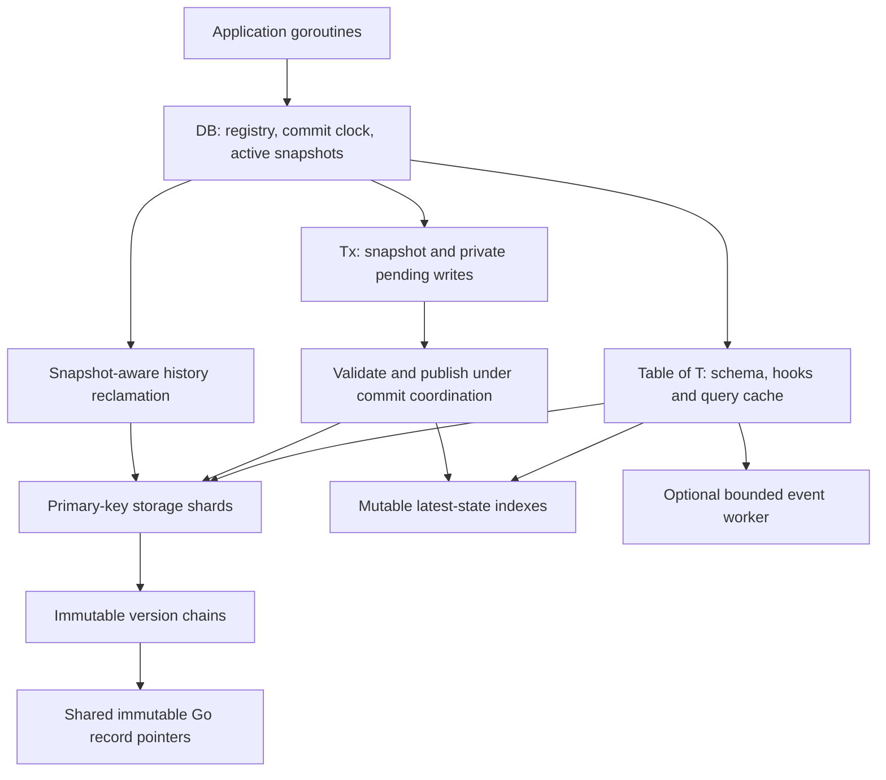
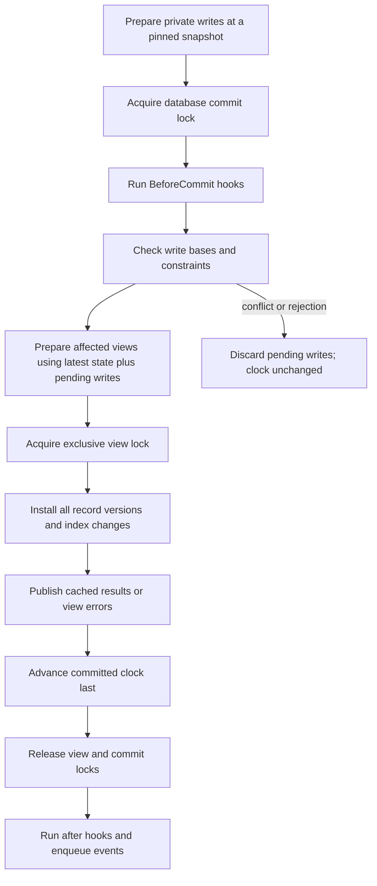

# RIME architecture

This document describes the current implementation of the Rapid In-Memory
Engine. [USAGE.md](USAGE.md) covers the public Go syntax. The
[performance plan](../architecture/rime-performance-plan.md) describes further
work; a planned optimization is not a current guarantee.

Contents:

1. [Purpose and boundaries](#1-purpose-and-boundaries)
2. [Components and ownership](#2-components-and-ownership)
3. [Schema registration and field access](#3-schema-registration-and-field-access)
4. [Storage, records and version chains](#4-storage-immutable-records-and-version-chains)
5. [Point reads and snapshot visibility](#5-point-reads-and-snapshot-visibility)
6. [Write staging and commit publication](#6-write-staging-and-commit-publication)
7. [Locks and concurrency limits](#7-locks-and-concurrency-limits)
8. [Index structures and maintenance](#8-index-structures-and-maintenance)
9. [Query planning and execution](#9-query-planning-and-execution)
10. [Aggregates, joins and projection](#10-aggregates-joins-and-projection)
11. [Constraint semantics](#11-constraint-semantics)
12. [Hooks, events and integration](#12-hooks-events-and-integration)
13. [History reclamation and lifecycle](#13-history-reclamation-and-lifecycle)
14. [Limits and observability](#14-limits-and-observability)
15. [Speed and remaining work](#15-how-the-design-delivers-speed-and-remaining-work)
16. [Source map and verification](#16-source-map-and-verification)
17. [Maintained query views](#17-maintained-query-views)

## 1. Purpose and boundaries

RIME stores native Go records and provides relational operations through typed
functions. Its goal is fast local access with concurrent readers and writers,
repeatable snapshots, indexed queries and atomic transactions across tables.
It avoids query parsing, record serialization, a network hop and disk I/O on the
core execution path. The engine imports only the Go standard library.

These choices remove substantial work, but do not guarantee that every operation
beats all alternatives or scales linearly with CPU count. Record allocation, reflected
field access, index maintenance, retained history and synchronization still cost
CPU and memory. Concurrent transaction preparation is implemented; parallel
commit publication is not. Every write commit currently takes a database-wide
lock, including writes to unrelated tables.

RIME has no built-in persistence, WAL, crash recovery, encryption, replication,
wire protocol or server. Data lives in the process heap. Hooks expose changes
for application integrations, but do not themselves supply durability or a
replication protocol. This package is separate from Murmur's spool storage and
QUIC replication components.

## 2. Components and ownership



`DB` owns table registration, the committed `TxID` clock, generated-ID sequence,
active transaction tracking, global commit/publication locks and optional GC
worker. `Table[T]` owns schema/accessor metadata, storage shards, indexes,
constraints, hooks, event subscriptions and the plan cache. Internal `innerTable`
methods let a transaction operate across different record types.

`Tx` owns one pinned snapshot and private mutation state. `Tx.Batch` reuses
the operation savepoint, including restoration of earlier superseded flags
when later operations fail. It is used by one
goroutine; sharing a transaction concurrently is unsupported. The database and
its tables support multiple goroutines with separate transactions. Query
builder methods return independent values, so query values can be branched and
shared for reads. A transaction remains single-goroutine-use.

Returned `*T` pointers refer to published records. The application must treat
those records, and every reachable nested value, as immutable. RIME relies on
this ownership rule rather than copying each read or preventing mutation through
the Go type system. Record pointers may outlive their transaction; Go keeps
referenced objects alive, although that closed transaction cannot perform more
operations.

Sources: [db.go](db.go), [table.go](table.go), [tx.go](tx.go),
[record.go](record.go), [query.go](query.go).

## 3. Schema registration and field access

`Register[T]` inspects exported struct fields, parses tags, validates the primary
key and builds schema/index metadata. Exactly one primary field is required.
The struct name is the default table name; options can supply a name, shard
count, compound indexes, constraints and cloner. Anonymous struct fields are
not recursively expanded as embedded schemas.

Supported primary-key kinds are strings, signed/unsigned integers including
`int`/`uint`, and 16-byte arrays, including `UUID`. Index keys must satisfy the
index's supported type rules. Compound index registration rejects unsupported
non-comparable fields instead of allowing a later map-key panic.

Schema discovery occurs at registration, and field access is reflection-free
on the hot paths. Registration records each top-level field's byte offset,
and exact-type handle construction compiles to one unsafe offset load with
no allocation; only converted types (interface fields requested concrete)
use `reflect.ValueOf`, field-index paths and `Interface()`. Typed handles
wrap these accessors and check the requested field type when constructed.
Unknown fields or incompatible handle types panic as programmer errors.
Predicate values remain native Go values; they are not encoded into
database row bytes.
Pointers and `Optional[T]` represent absent fields. `Some(zero)` remains
present, and scalar zero values are never treated as absent by the new presence
API. The legacy scalar `nullable` tag keeps its zero-as-NULL interpretation.

For unchanged-field detection, registration also builds scalar equality
functions using reflected integer, string, bool and floating-point accessors
without interface boxing. Index updates can therefore skip an unchanged field
before extracting its old/new values. Unsupported comparison forms conservatively
follow the normal maintenance path.

`uuid5` generation uses the table namespace and an independent atomic
allocation sequence on the database. `NewUUIDv5` is deterministic for a given
namespace/name; automatic zero-key generation supplies a fresh sequence-derived
name. Allocations are distinct within a database lifetime, including batches,
but do not guarantee uniqueness across separate database instances.
`UUID` is a 16-byte value with `String`, `ParseUUID` and `IsZero` helpers;
`TableNamespace` derives the namespace used by automatic generation. UUIDv5
uses the standard library's SHA-1 implementation.

Sources: [schema.go](schema.go), [field.go](field.go), [uuid.go](uuid.go),
[table.go](table.go).

### Runtime registration

`RegisterType` accepts a `reflect.Type` and reuses the generic registration
initializer with a `Table[any]` carrier. Its `*any` records contain native struct
pointers; field/default/validation accessors unwrap carriers, and prepared
changes unwrap them before adapter capture. Typed registrations retain their
native offset loads. Runtime field handles use compiled reflective accessors,
with the same normalized hash/ordered indexes and planner metadata. Carrier
cloning uses the declared generic type, retaining an independent native record.
`WithPrimaryField` selects physical identity separately from other primary-tag
indexes; `WithPrimaryKey` supplies a deterministic canonical key accessor.
Murmur's [model adapter](../architecture/model-api.md) owns durable schema and
UUID generation, while RIME continues to import only standard-library packages.

## 4. Storage, immutable records and version chains

Each table defaults to 64 primary-key shards. A key's hash selects its shard;
each shard has an `RWMutex` and a `map[any]*chain[T]`. Common key types have
specialized hashing paths. `WithShardCount` sets the database default and
`WithTableShards` overrides it for a table. Shards partition storage and read
locking; they do not independently commit transactions.

A version chain is an immutable slice ordered by commit ID. A version contains
its `TxID`, a record pointer and a tombstone flag. Several writes to one key in
one transaction can produce several versions with the same commit ID. Snapshot
lookup selects the last version whose commit ID is at most the snapshot.

For illustration:

```text
key "device-1"
  commit 7:  pointer to {Status: 1}
  commit 12: pointer to {Status: 2}
  commit 18: tombstone

snapshot 10 -> Status 1
snapshot 15 -> Status 2
snapshot 18 -> ErrNotFound
```

A write clones the record and installs a new chain pointer. The existing
record and chain are never modified. The default clone recursively copies
exported fields, including maps, slices, arrays and pointers, so inserted input
and each new version own their mutable values. `Cloner[T]` or `WithCloner`
overrides this behavior for custom ownership needs, including state held in
unexported fields. Cyclic record graphs are outside the supported record model.

Current chain append allocates a slice of `old length + 1` and copies the old
versions. Snapshot lookup is O(log H) for H retained versions, but append is
O(H). Repeated hot-key updates with retained history can therefore accumulate
quadratic copying work. Persistent/chunked history is planned, not implemented.
The Go collector frees unreachable objects; RIME's GC separately decides which
versions can be removed from database storage.

Sources: [shard.go](shard.go), [mvcc.go](mvcc.go), [record.go](record.go),
[table.go](table.go).

## 5. Point reads and snapshot visibility

An explicit read transaction samples the committed clock and registers its
snapshot while holding the publication/view read lock. GC cannot reclaim
history between those two operations. The transaction keeps its original
snapshot until closed or made unusable by a configured lifetime limit.

`Get(tx, key)` checks transaction ownership, state, age and cancellation. In a
write transaction it first checks staged writes: the newest pending value wins,
and a pending delete returns `ErrNotFound`. Otherwise it reads the shard map
under a short shard read lock, captures the immutable chain pointer, releases
the lock and binary-searches the snapshot-visible version.

An explicit pinned point read does not acquire the database view lock again.
Its registered snapshot retains the history it needs. An automatic `Get(nil,
key)` instead briefly takes the view read lock while sampling the latest clock
and capturing the chain. It does not create a tracked transaction for that
single lookup. Once captured, the chain remains safe to examine even if a
writer or GC replaces the shard's pointer.

This is why readers can share record pointers with low overhead: they perform
hash/map lookup and visibility selection without row decoding or a record copy.
The map lookup still uses synchronization; the entire read API is not lock-free.
Repeated independent automatic reads may observe different commits. Use one
explicit snapshot when several reads must agree.

Sources: [table.go](table.go), [tx.go](tx.go), [mvcc.go](mvcc.go).

## 6. Write staging and commit publication

### 6.1. Private staging

`WriteTx` opens a tracked snapshot, calls application code and commits only if
the callback returns nil. A callback error discards pending writes. `Upsert`,
`Insert`, `Update` and `Delete` with a nil transaction use an automatic write
transaction. `BeginTx` exposes the same staged transaction for hosts that need
explicit `Commit`/`Rollback` control; either terminal operation releases the
snapshot, and a failed commit also closes the transaction. Bulk methods group
records into one transaction and pre-size pending storage rather than
committing each row separately.

Updates read the transaction-visible record, capture its base version before
calling user mutation code, clone it and mutate the private copy. Changing its
primary key fails validation. Inserts/defaults and operation hooks run while
changes are private. Deletes stage a tombstone. Existing published records
supplied as old values to update/delete hooks remain immutable.

Pending writes retain record identity, observed base version, operation and
old/new pointers. Normal commit work dispatches through table methods, avoiding
separate check/validate/apply closures per row. Post-commit changes are collected
as effects instead of creating a normal callback closure for each mutation.
Optimistic base checks tolerate GC collecting a tombstone base between staging
and commit: an absent head over a tombstone base is still deleted, not a
conflict, because any intervening writer commit would leave an entry behind.

Single-write transactions avoid allocating a staged lookup map. Once more than
one mutation is buffered, the transaction creates a `(table,key)` map pointing
to the newest pending write; subsequent staged point lookups are expected O(1).
Repeated-key writes retain their mutation sequence and original optimistic base.
Queries read the transaction snapshot and overlay the transaction's final
staged values, so a query in a write transaction sees its own inserts, updates,
and deletes. The overlay may require scanning beyond the indexed candidate set.

`Tx.PreparedChanges` captures one detached final-state delta per table/key in
first-touch order. It includes the original optimistic base and cloned old/new
records, and omits insert-then-delete no-ops. Capture does not validate or
reserve a commit; normal commit still performs authoritative conflict checks.
This gives persistence adapters a change representation without exposing the
transaction's mutable staging objects.

Explicit `BeginTx` callers may use `PrepareCommit` to obtain a managed token.
It runs BeforeCommit hooks, checks optimistic bases and constraints, prepares
maintained views, and captures changes while holding `commitMu`. The transaction
rejects further writes until the token publishes or aborts, preventing another
writer from invalidating the validated base. `Publish` installs the records,
indexes and prepared views under the normal visibility lock, then releases
commit order before notifications. Adapters must publish after durable success
and abort only after a known pre-durable failure. This token is the ordered
integration boundary; the ordinary standalone RIME commit path remains
independent of persistence.

`PrepareCommit` performs optimistic base checks, staged-value type assertions,
primary-key and constraint validation, unique-claim checks, maintained-view
delta computation, callback-slice sizing, and copy-on-write MVCC-chain building
before durability. Repeated writes to one key build a sequence of prepared
heads that publication installs in order. New keys crossing a shard's tracked
growth threshold receive a sized replacement map before durability; publication
swaps it under the shard lock. Unique claims are normalized and prepared from
the final overlay before durability. A unique map is cloned only when its
projected size crosses its tracked capacity; smaller updates release claims
before adding new ones in the existing map. Changed compound-index key
projections are also prepared before durability. This avoids copying index
maps for ordinary inserts and moves compound-key extraction and tracked
unique-map growth out of publication. Managed ordered-index writes
now prebuild AVL nodes and directory entries, and replace the directory map
only when a transaction crosses its tracked growth threshold. Managed prefix
and compound preparation creates path-only nodes and reserves record-key maps
before durability; abort prunes empty paths, while publication adds record
keys and defers pruning old paths until every write is installed. Managed hash
preparation grows outer maps and collision sets before durability, seeds empty
shared-value sets as publication begins, and projects hash keys before
installation. Prefix/compound insertion and deletion and hash insertion have
allocation-count regression coverage. A managed-install test combines these
indexes with unique claims, ordered-index growth and shard-map growth, and
verifies at most two allocations after preparation for a mixed indexed and
shard-growth transaction. A
panic during locked installation
after durable success freezes the database: every read/write entry point rejects
with `ErrDBFaulted`, locks are released, and `Publish` returns
`*UncertainCommitError` carrying the commit generation and panic cause. The
adapter can then report the uncertain outcome with its transaction ID and
recover from durable state. After-commit callbacks run outside the fault window:
a callback panic propagates like a standalone commit without faulting the
published database.

### 6.2. Validation and publication order



The general commit path checks the first base for each touched key against its
current head. If another transaction changed that key, it returns `ErrConflict`.
It computes the final write per key and validates the complete transaction
before installing any record. Unique ownership uses a transaction-local overlay
so final-state swaps and intermediate value reuse are possible.

Publication takes the exclusive view lock and installs every version and index
change before advancing `db.clock`. An old snapshot can encounter newly
installed chains but selects only its older versions. A new snapshot or latest
index plan cannot be created midway through publication. This combination makes
multi-key and multi-table changes visible together.

The single-write fast path avoids the general seen-table, checked-key,
final-write and nested claim maps. It validates uniqueness directly, skipping
unchanged values, then publishes one record and its unique ownership. If a
BeforeCommit hook adds writes, it promotes to the general path and avoids
rerunning that table's hook. The fast path uses the same commit/view locks;
it reduces bookkeeping without providing concurrent commits.

Cancellation/lifetime checks occur before publication. Validation and source transaction callback
errors before publication leave records, indexes and clock unchanged. View
evaluation errors instead publish an unavailable view with the valid source
commit; see [Section 17](#17-maintained-query-views). Once
publication succeeds, errors or panics in after hooks cannot roll it back.
The implementation releases transaction tracking and the commit lock on
pre-publication callback panic. It does not provide recovery from arbitrary
panics or process failure during the installation loop.

### 6.3. Isolation and contention

The isolation model is snapshot isolation with optimistic write conflict
detection. It does not validate a complete predicate/read set and does not
claim serializable execution. Two transactions updating different keys can
both succeed even if each made a decision from an older snapshot.

Many goroutines may prepare writes simultaneously, but all nonempty commits
serialize. Empty transactions do not advance the clock. Longer batches amortize
transaction overhead but also hold commit/publication coordination longer.
Hot-key writers additionally face conflicts and repeated history allocation.
Applications retry an entire rejected transaction when appropriate; RIME does
not silently retry callbacks with possible external side effects.

Sources: [tx.go](tx.go), [table.go](table.go), [index.go](index.go).

## 7. Locks and concurrency limits

| Synchronization | Protects | Consequence |
| --- | --- | --- |
| `DB.commitMu` | Live validation and write commit ordering; coordinates GC | All commits, even disjoint ones, serialize |
| `DB.viewMu` | Atomic publication, snapshot registration, index planning, coherent stats and GC | Publication/GC can delay new snapshots and automatic reads |
| Shard `mu` | Primary-key map lookup, chain replacement and pruning | Readers on different shards need different storage locks |
| `indexSet.mu` | A table's mutable index bundle | Index maintenance is table-wide, inside serialized publication |
| `DB.activeMu` | Active snapshot registry | Registration/release and oldest-snapshot calculation coordinate |
| Plan-cache `mu` | Cache entries and FIFO order | Concurrent plans safely share immutable cached candidates |
| Table `mu` | Hooks, constraints, event bus configuration | Callback/configuration metadata is synchronized |
| Event `emitMu` / `mu` | Producer/closure coordination and subscriber state | Bounded delivery and shutdown avoid send/close races |

Commit acquires `commitMu` before `viewMu`; GC uses the same order. Record
installation holds one shard's write lock while copying/installing a chain,
releases it, then updates indexes under the index lock. User post-commit hooks run after the global
commit/publication locks are released. Snapshot readers release shard locks
before traversing immutable chains or evaluating predicates.
Long retained chains increase the duration of the shard write critical section.

Sharding helps read concurrency and keeps map critical sections local, but
increasing shard count cannot remove the global write bottleneck. Reader work
can overlap with private writer preparation and some publication work. Readers
are not guaranteed to avoid waiting: automatic point reads and new snapshots
need the view lock, and any point lookup may wait for its shard lock.

GC currently holds global commit and view locks for its full pass. Stats scan
storage while holding the view read lock. Both can affect writer latency at
large table sizes. These are explicit operational costs of the current design.

## 8. Index structures and maintenance

Indexes represent the latest published table state. They are mutable structures
protected by the table's index lock; copy-on-write applies to records and
version chains, not the index bundle itself.

| Kind | Representation | Main use and cost |
| --- | --- | --- |
| Unique | `field value -> primary key` map | Expected O(1) equality and ownership checks |
| Hash | `field value -> set of primary keys` | Expected O(1) bucket seek, plus matched keys |
| Compound | Nested native-value maps, one level per field, with key sets at leaves | Equality on all indexed fields; no compound string encoding |
| Ordered | AVL tree of distinct values, linked key buckets, key directory | O(log D) add/remove, pruned range traversal; D is distinct values |
| Prefix | Byte trie with descendant key sets at every node | O(prefix length + output) lookup, with extra memory per string prefix |

Primary/unique fields currently have both unique and hash maps. Compound
indexes match conjunctions covering all of their fields; they do not supply a
Ordered left-prefix range index. Prefix indexing is byte-oriented;
`LIKE` filtering also treats `_` as one byte rather than Unicode collation.

The ordered index balances value nodes, keeps duplicate-value keys in insertion
order and locates an existing key through its directory. Removal does not scan
or shift all entries. An update whose ordered value changes removes its old
entry and adds the new entry; unchanged values retain their position. Descending
traversal reverses buckets. Without explicit secondary ordering, duplicate-value
order should not be used as an application pagination guarantee.

Commit removes/replaces entries only for changed indexed fields. Field comparison
fast paths avoid boxing unchanged values first. Hash reference counts and index
cardinality information support selectivity estimates. Deletion removes live
index entries at commit; later tombstone reclamation does not scan every index
for each deleted key.

For multi-write commits, unique indexes publish the final validated ownership
claims after row installation. This avoids an intermediate mutation accidentally
erasing another row's final owner. General validation permits two touched rows
to swap unique values while still rejecting a duplicate final state.

Sources: [index.go](index.go), [index_hash.go](index_hash.go),
[index_unique.go](index_unique.go), [index_compound.go](index_compound.go),
[index_ordered.go](index_ordered.go), [index_prefix.go](index_prefix.go).

## 9. Query planning and execution

### 9.1. Snapshot-safe planning

A query pins a transaction snapshot, then plans under the view read lock.
Each table's `lastChange` records its latest write generation. If the snapshot
predates that change, latest-state indexes cannot enumerate all historical
matches and the planner chooses a full scan.

For example, changing `Status` from 1 to 2 removes a key from the current
`Status=1` index. A historical query that should see Status 1 would miss the row
if it trusted that current candidate set. Checking visibility of candidates
cannot recover a key that is absent from the set. The historical scan instead
examines retained chains and evaluates the old record's predicates.

For a fresh snapshot, planning considers full compound equality coverage,
selective equality, IN/eligible OR unions, ordered ranges, prefix lookups,
ordered scans and finally full scans. It estimates equality choices before
building the winning candidate set. Contradictory equality predicates and false
expressions can produce an empty plan. `Explain` describes the selected strategy,
index, candidate estimate, filters, ordering and limits.

### 9.2. Cache and temporary ownership

The per-table plan cache holds up to 128 query fingerprints with FIFO eviction.
A cached plan is valid only for the table generation it captured. Changed
generations replace stale entries, while older snapshots bypass the cache.
The fingerprint captures query shape/values and ordering; compiled queries bind
parameters for each execution before using the same planning machinery.

Cached candidate maps/slices belong to the cache and are immutable after
publication. Join/FK temporary key-set maps can instead come from a `sync.Pool`.
A temporary scope clears and returns them exactly once; they must not escape
into a cache or an application result. Pool hit counters describe reuse, not
a guaranteed retained pool size or memory limit.

Planner row estimates sum map lengths under each shard's read lock. This is
O(shard count), not a complete record scan, but it remains synchronization work
on cached query execution. These estimates count map entries including tombstones,
not necessarily snapshot-visible rows.

### 9.3. Execution, ordering and full scans

Indexed execution captures candidate keys, looks up each snapshot-visible record
and retests all predicates. Candidate ownership remains safe if a later commit
changes the live indexes after planning. A full scan copies each shard's chain
pointers under its read lock, then releases it before visibility search and
predicate evaluation. It never iterates a mutable shard map across lock releases.

`Find` materializes a slice of shared record pointers. `Count` uses the same
matching path without materializing or sorting records. Matching ordered-index
traversal supplies ordering directly; other orderings sort materialized results.
Limit/offset can stop unordered or matching ordered paths early when enough
matches exist; incompatible ordering may require collecting and sorting more
rows. Unordered map-based results have no stable ordering guarantee.

Context checks occur at entry, at execution checkpoints and before returning.
Scans typically check every 64 examined records/candidates; cancellation is
cooperative, not an interruption of arbitrary user code or sorting. Scan/result
caps reject excess work/results with `ErrLimitExceeded`.

A full-table scan is O(N) visibility/predicate work. `Each` can visit records
without creating a result slice when the plan yields the requested order; sorted
plans and transaction-local write overlays currently use materialization.
Current benchmarks distinguish visiting every returned record from COUNT/AVG
aggregation.

Sources: [expression.go](expression.go), [query.go](query.go),
[planner.go](planner.go), [executor.go](executor.go), [explain.go](explain.go),
[pool.go](pool.go).

## 10. Aggregates, joins and projection

Aggregations operate on native field values. General aggregation first calls
`Find` to obtain matching records, then evaluates each aggregate over that slice.
COUNT returns an integer; SUM/AVG use `float64`; empty AVG is zero and empty
MIN/MAX are nil. This is currently materialized execution rather than streaming
or a fused single-pass aggregate pipeline.

An unfiltered, unlimited, unoffset single MIN/MAX can use an ordered index's
extreme value when the table is fresh at the snapshot and no pending-write
overlay exists. Historical, overlay or unsupported cases fall back to visible record scanning. Grouping materializes matches and
uses length-framed, type-qualified group identities to avoid delimiter
collisions; grouped records feed the same aggregate operators.

Joins with a nil transaction create one common snapshot for both tables. Tables
must belong to the same database. `InnerJoinOn` and `LeftJoinOn` prefer indexed
nested-loop probes when the right equality index is usable. If publication makes
the right table stale, the join uses snapshot-visible right-hand hash buckets
rather than mixing current indexes with historical left records. Pending writes
disable index probes and are included in both join inputs, preserving
read-your-writes and view-preview semantics.

The hash-join path materializes table snapshots, builds right-side key buckets
and produces pointer pairs. Duplicate keys can generate many pairs; LEFT JOIN
keeps unmatched left rows with a nil right pointer. Self-joins use the same
snapshot. `InnerJoin` accepts key functions and `JoinPairs` operates over existing
row slices. RIGHT/FULL JOIN are not implemented. Join callbacks run outside
publication view locks and must respect record immutability.

Projection explicitly creates application-selected new values. `Project` reads
query results, applies a function and returns a new result slice; `Map` transforms
an existing row slice. The returned values may allocate or contain shared nested
references according to the application function. RIME does not automatically
deep-copy arbitrary projection results.

Sources: [aggregate.go](aggregate.go), [join.go](join.go),
[projection.go](projection.go).

## 11. Constraint semantics

Primary-key identity, unique ownership, NOT NULL, CHECK callbacks, defaults and
foreign-key existence checks are supported. Pointers and `Optional[T]` carry
presence; `notnull` rejects their absent state, while `Some(0)`, `Some(false)`
and `Some("")` are present values. Defaults fill only absent pointer/optional
fields on insert/save. Ordinary scalar fields are always present. The legacy
scalar `nullable` tag retains its zero-as-NULL query behavior.

New/updated records are checked while staging and revalidated before publication.
General commits validate each staged record's CHECK/NOT NULL/FK rules, but unique
claims are evaluated for the final value of each touched key. Rejecting any
record before publication rejects the transaction. `ConstraintError` carries
context and unwraps the corresponding sentinel for `errors.Is`.

Foreign keys are disabled by default. Enabled checks examine referenced committed
records under publication coordination; they do not resolve pending parent
inserts in another table as a transaction-local referential view. Parent deletion
is not reverse-checked against all referencing rows, and cascading referential
actions are not implemented. This is existence validation for new/updated
records, not a claim of full foreign-key behavior. Referenced non-primary
lookups depend on supported equality indexes.

Sources: [constraint.go](constraint.go), [schema.go](schema.go),
[table.go](table.go), [errors.go](errors.go).

## 12. Hooks, events and integration

BeforeInsert sees a private new record. BeforeUpdate sees an immutable old record
and a private new record. BeforeDelete sees the immutable record being removed.
An operation-hook error prevents that mutation from being staged. BeforeCommit
runs under the commit lock once per touched table for the transaction; it may
reject the complete transaction. Keep it fast and do not start another write,
run GC or close the database from it. Operation/BeforeCommit hooks also run
while their table's hook read lock is held; do not mutate hook registration
from inside those callbacks.

AfterInsert/Update/Delete, AfterSave and AfterCommit run synchronously after
publication locks are released. They receive committed records and cannot undo
the commit. In the current implementation the table's AfterCommit hooks run
for each committed change, so a multi-row transaction can deliver the same TxID
several times. They are not a once-per-transaction external durability barrier.
After-hook panic propagates after data has committed.

Async subscriptions use one lazily started worker per table and a bounded
channel of `Change[T]` values, not one goroutine per event. The default capacity
is 1024 changes. A full queue blocks the writer's post-commit emission by default;
`WithEventDropOldest(true)` permits loss to bound producer waiting. Slow callbacks
can therefore affect write return latency even after releasing the commit lock.
There is no built-in panic recovery for the async worker's user callbacks.

Producer emission and channel closure coordinate through `emitMu`. Shutdown
closes the queue and waits for the worker to drain; callbacks must return.
Callbacks must not close their own worker, or synchronously write to their own
table under blocking backpressure, because progress can depend on that worker.
Subscribing after close starts no worker. A shutdown racing post-commit emission
may suppress that event. Different writers emit after releasing commit locks,
so events are not a guaranteed global commit-order stream or durable log.

Persistence/replication adapters must define their own ordering, idempotence,
recovery and acknowledgement semantics around these hooks. Successfully
returning from an in-memory transaction alone establishes no disk durability.

Sources: [hook.go](hook.go), [event.go](event.go), [table.go](table.go).

## 13. History reclamation and lifecycle

RIME GC calculates the oldest active usable snapshot, then retains the newest
version at or before that snapshot and every later version. That boundary
version is necessary for the oldest reader even if older versions are removed.
A final tombstone at or before the horizon allows physically removing the key.
If no snapshots are active, GC can keep only the latest live version or remove
a fully deleted row.

GC takes `commitMu` and the exclusive view lock for the pass. This prevents
writes and new snapshot registration from racing the retention decision.
Shard write locks protect map replacement/pruning. Old captured chains remain
safe through Go object references; reclamation replaces storage pointers rather
than mutating those chains. Live indexes were already updated by deletion,
so physical tombstone removal needs no per-key index sweep.

The database records a retained floor. `ReadAt` below that floor yields a
transaction whose operations return `ErrSnapshotUnavailable`; requests above
the latest commit are clamped. Keeping a valid snapshot open preserves its
required history. With `WithMaxTxAge`, expired snapshots stop pinning retention
and subsequent operations fail with `ErrLimitExceeded`.

`WithGCInterval` enables a periodic worker; by default callers invoke GC
explicitly. Cancellation checks can stop a pass after some shards/keys were
processed; completed pruning stays valid. RIME reports reclaimed version counts,
not physical heap bytes. Application-held pointers, old captured chains and
queued events can keep objects reachable after removal from storage.

Closing a transaction discards its staged writes and releases its snapshot.
Write callbacks are automatically cleaned up on return/unwind. Closing the
database marks it closed, stops background GC and closes/drains event workers.
New snapshots, registration, automatic reads and writes fail with ErrDBClosed.
Existing read transactions remain readable and still need to be closed. Close
is a lifecycle operation, not persistence or destruction of application-held
record pointers.

Sources: [gc.go](gc.go), [db.go](db.go), [tx.go](tx.go), [stats.go](stats.go).

## 14. Limits and observability

Result count, examined records, mutations per transaction and transaction age
can be capped through database options. Zero leaves a cap unlimited. These
limits are semantic operation bounds, not a complete process-memory budget.
Contexts are checked cooperatively; application callbacks are responsible for
returning and respecting their own external cancellation requirements.

Stats combine committed record/version/tombstone counts, active snapshots,
latest clock, index totals, plan-cache hits/misses, GC totals and temporary-pool
hits. Stats take a coherent view read lock and traverse storage/index state;
frequent full stats collection can delay publication on large databases.
`OpenTransactions` and `DetectLeaks` expose snapshots retaining old history.
Counts do not replace runtime heap/RSS measurements or allocation profiles.

`DBStats` exposes `Tables`, `Records`, `Versions`, `Tombstones`, `ActiveTxns`,
`OldestSnapshot`, `LatestCommit`, `IndexEntries`, `GCReclaimed`, `GCRuns`,
`TempPoolGets`, `TempPoolHits` and `TablesDetail`. `TableStats` exposes live
record counts, retained versions, tombstoned heads, total index entries,
`PlanHits`, `PlanMisses` and an `Indexes` map. Each `IndexStat` records `Name`,
`Kind`, `Entries`, `Cardinality` and `Selectivity` (distinct fraction).
`OpenTransactions` returns transaction IDs, snapshot IDs, ages and whether
they are writers; `DetectLeaks` filters long-open transactions by age.

The relevant caps are `WithMaxResults`, `WithMaxScan`, `WithMaxMutations` and
`WithMaxTxAge`; cancellation failures return context errors, cap/age failures
return `ErrLimitExceeded`. Transaction misuse reports `ErrTxClosed`,
`ErrTxReadOnly` or `ErrTxDatabase`. Lifecycle/history failures report
`ErrDBClosed` or `ErrSnapshotUnavailable`. Constraint and schema sentinels are
listed in [errors.go](errors.go).

Sources: [stats.go](stats.go), [db.go](db.go), [executor.go](executor.go).

## 15. How the design delivers speed, and remaining work

| Implemented mechanism | Work avoided or reduced | Remaining cost |
| --- | --- | --- |
| Native record pointers | Row serialization/decoding and per-read record copies | Immutability discipline and reflected field access |
| Sharded maps | One global map lock for every lookup | Short shard locks and global snapshot/publication coordination |
| Immutable MVCC chains | Reader/writer mutation of the same record | Full retained-chain copy on append |
| Single-write commit path and lazy staged map | General transaction maps and usual per-row commit closures | Global commit serialization and record allocation |
| Unchanged-field comparison | Removing/readding unchanged index entries | Changed-field extraction and index maintenance |
| AVL ordered index | Linear removal/search/shifting in the former sorted slice | Node/bucket allocation, tree traversal and table index lock |
| Selective planning and bounded cache | Repeated candidate construction on unchanged tables | Historical fallback, invalidation and shard-count estimates |
| Scoped pooled candidate maps | Repeated temporary key-set allocation | Pool misses, clearing and cache ownership constraints |
| Batched writes | A separate transaction/commit for every row | Longer atomic publication sections |
| Bounded event worker | Unbounded goroutine creation per event | Backpressure, callback latency and optional event loss |

The [benchmark document](../architecture/rime-benchmarks.md) records methods and
measurements, including the earlier profiles and later single-write optimization
results. Historical profile allocation figures should not be presented as the
current optimized implementation's baseline. Ratios against other embedded
engines depend on indexes, transaction size, output materialization and
driver/configuration cost;
in-memory Go alone does not establish a speed advantage.

The [performance plan](../architecture/rime-performance-plan.md) covers remaining
allocation work, persistent history, index overhead, shorter commit coordination,
parallel independent commits and query improvements. Concurrent publication
requires key/unique-value reservations, atomic visibility, compatible index
reads and safe GC; deleting the global mutex is insufficient. Parallel commits,
versioned indexes and chunked history are not current features.

## 16. Source map and verification

| Files | Responsibility |
| --- | --- |
| [doc.go](doc.go), [errors.go](errors.go), [uuid.go](uuid.go) | Package contract, errors and identifiers |
| [db.go](db.go), [table.go](table.go), [tx.go](tx.go) | Registration, CRUD, lifecycle and commit orchestration |
| [mvcc.go](mvcc.go), [shard.go](shard.go), [record.go](record.go) | Version visibility, storage partitions and copying |
| [gc.go](gc.go), [stats.go](stats.go), [pool.go](pool.go) | Retention, observability and temporary ownership |
| [schema.go](schema.go), [field.go](field.go) | Metadata, accessors and typed handles |
| [index.go](index.go) and `index_*.go` | Index structures and maintenance |
| [expression.go](expression.go), [query.go](query.go), [planner.go](planner.go), [executor.go](executor.go), [explain.go](explain.go) | Predicate construction, planning, matching and diagnostics |
| [view.go](view.go), [view_test.go](view_test.go), [view_live_test.go](view_live_test.go) | Maintained query results, failure/lifecycle tests and live comparison workloads |
| [aggregate.go](aggregate.go), [join.go](join.go), [projection.go](projection.go) | Relational operators |
| [constraint.go](constraint.go), [hook.go](hook.go), [event.go](event.go) | Validation and callback integration |
| [qualification_test.go](qualification_test.go), [qualification_internal_test.go](qualification_internal_test.go), [qualification_events_test.go](qualification_events_test.go), [qualification_live_test.go](qualification_live_test.go), [qualification_fuzz_test.go](qualification_fuzz_test.go) | Models, publication barriers, lifecycle, races and live invariants |
| [index_ordered_test.go](index_ordered_test.go) | AVL model and mutation complexity checks |
| [qualification_bench_test.go](qualification_bench_test.go), [freeze_bench_test.go](freeze_bench_test.go), [write_profile_test.go](write_profile_test.go) | Size benchmarks, acceptance matrix and profiling |

The [qualification runbook](../architecture/rime-testing.md) defines race/model
checks, fuzzing, retention tests, publication barriers and standalone live
workloads with concurrent transfers, readers, writers, GC and events. Its live
harness exercises the engine directly, including cross-table atomicity and
cleanup. Optional historical comparisons live in the separate
`tests-benchmark/rime-sqlite` module and are excluded from default root-module
test discovery.

Performance claims require repeated comparable unprofiled runs and live
correctness evidence. A short smoke test, a single ratio or an architecture
intention alone does not establish production readiness.

## 17. Maintained query views

`View[R]` caches immutable result values under a database-local name. Definitions
are registered through `NewView` or `NewComputedView`, not a query language or table schema.
See [the complete API contract](USAGE.md#maintained-query-views).

`DB` owns name and source-table registries protected by `commitMu`. Both commit
paths determine affected views after hooks and validation. Each view prepares
publication work once per transaction, outside `viewMu` while holding commit
serialization. A private untracked read-only transaction samples the **current**
commit and borrows final pending writes; GC also takes `commitMu`, so preview
history cannot disappear. Closing this preview never returns borrowed writes
to the write pool. Point reads, query iteration, aggregates and joins include
pending changes independently of write permission. Index-only extrema and join
probes fall back when overlays exist; ordered overlays are sorted again.
Declared-source guards reject undeclared reads and writes even if a callback
ignores their returned errors. All preview handles become closed after evaluation.

Before source publication, cancellation/age/lifecycle checks run again. Under
`viewMu`, commits install records and indexes, publish prepared cache changes or
view errors, and advance the clock last. Reads continue observing the preceding
committed state during evaluation. Maintenance uses no async events or workers,
so event loss/backpressure cannot cause stale view results. Evaluation order
between independent views is unspecified and callbacks cannot depend on it.

Simple unordered, unpaginated views use a primary-key membership map. Maintenance
prepares only final changed-row membership and checks the resulting cardinality
against `maxResults`, with `maxScan` bounding final changed-row evaluations;
publication applies that delta. Join overlay inputs preserve scan limits rather
than applying the join-output result cap to each source table. Snapshot reads copy map
values into an independent slice. Ordered/paginated queries and custom callbacks
reevaluate completely, retaining a copied result slice. Thus reads cost O(result
count), while complex maintenance can cost a full query per relevant commit.
No historical result cache is retained internally; held snapshots retain their
own immutable results through normal Go reachability.

Errors or recovered callback panics produce `ViewError` with the attempted commit
and discard the cached result. Source writes and other views continue. The next
relevant commit or explicit refresh performs a complete rebuild. Initial failure
registers nothing. Registration, refresh, close and shutdown serialize with
maintenance; close/shutdown release builders, source references and results.
Callbacks run under commit serialization and must not reenter transaction, GC,
view lifecycle or database close operations. Captured unbound reads and external
state cannot be guarded and are outside the maintained-query contract.

Persistence, replication, nested views, additional result filtering, historical
view reads and incremental joins/aggregates are outside this implementation.
Sources: [view.go](view.go), [tx.go](tx.go), [executor.go](executor.go),
[join.go](join.go), [aggregate.go](aggregate.go).

## Checked runtime fields and timestamp keys

`DynamicFieldOf` compiles checked scalar/timestamp accessors and builds ordinary
expressions with field/operator metadata. Named scalars retain native value
types for hash/compound keys and use kind-specific comparators for ranges and
sorting. String predicates use existing prefix planning and wildcard matching.
Typed scalar accessors retain their direct-load path. `time.Time` index
extractors and query keys remove monotonic data and normalize to UTC; equality
and ordering compare wall-clock instants. Unique and compound timestamp indexes
use the same keys. Normalization does not mutate stored record fields.
